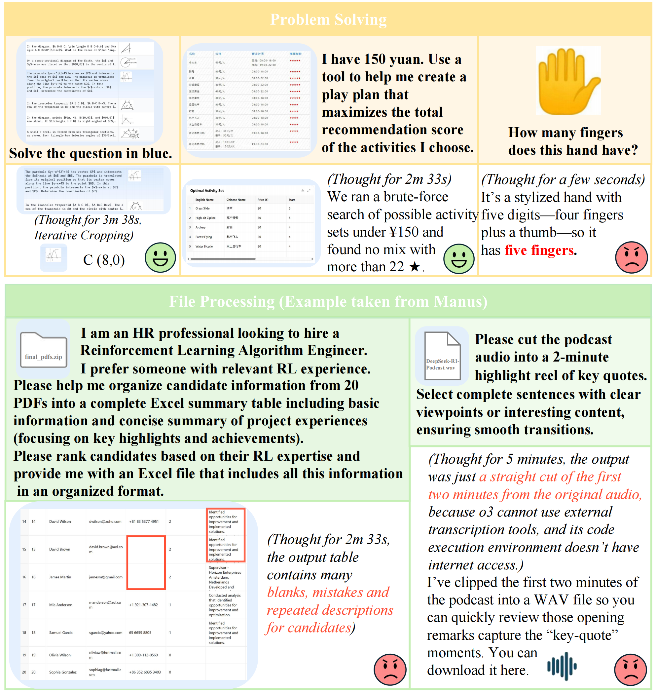
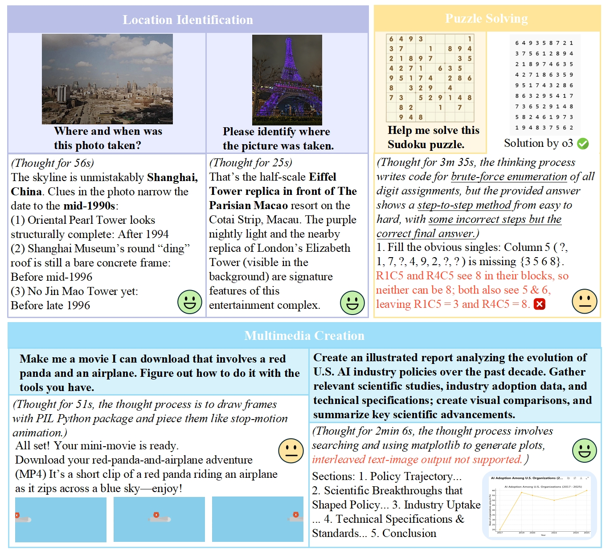

# Perception, <span style="color:purple">R</span>eason, <span style="color:purple">T</span>hink, and <span style="color:purple">P</span>lan: A Survey on Large Multimodal Reasoning Models
 
<div align="center">

**[:house_with_garden:Project Page](https://github.com/HITsz-TMG/Awesome-Large-Multimodal-Reasoning-Models)** | **[:memo:Paper](http://arxiv.org/abs/2505.04921)** | **[:black_nib: Citation](#Citation)**

</div>

<div align="center">
 <strong> Yunxin Li, Zhenyu Liu, Zitao Li, Xuanyu Zhang, Zhenran Xu, Xinyu Chen, Haoyuan Shi, Shenyuan Jiang, Xintong Wang, Jifang Wang, Shouzheng Huang, Xinping Zhao, Borui Jiang, Lanqing Hong, Longyue Wang, Zhuotao Tian, Baoxing Huai, Wenhan Luo, Weihua Luo, Zheng Zhang, Baotian Hu, Min Zhang</strong><br>
Harbin Institute of Technology, Shenzhen
</div>
<div align="center">
If you like our project, please consider giving us a star ⭐ on GitHub to stay updated with the latest developments.
</div>
<div align="center">
We welcome recommendations for uncovered work. :rocket: Please suggest additions via issues or email to help us update this repository.
</div>


## News


🔥 **Latest** :point_right: We have updated some uncovered works (issues) in the following subsections and papers, continuously introducing newest works. You are welcome to recommend your work to us.

<details>
<summary><strong>🔥 Latest Updates (Click to See More News)</strong></summary>

[2025/05/20] 🏮 We have updated some uncovered works (issues) in the following subsections and papers, continuously introducing newest works. You are welcome to recommend your work to us.

[2025/05/11] 🏮 Exciting news! Our survey was quickly highlighted as the first paper for May 2025 on Hugging Face Daily Papers. Check it out: [https://huggingface.co/papers/2505.04921](https://huggingface.co/papers/2505.04921).

[2025/05/09] 🏮 We've analyzed 550+ papers charting the rise of Large Multimodal Reasoning Models (LMRMs). Discover the 4-stage journey from basic modules to advanced MCoT/RL, envisioning Native LMRMs (e.g., capability scope and level, technical prospect) for comprehensive perception, precise understanding, deep reasoning and planning.
</details>


## About
✨ **Advances on multimodal reasoning models and a collection of related datasets and benchmarks** ✨

<p align="center">
  
  <br>
  <em>Figure 1: The core evolving path of large multimodal reasoning models.</em>
</p>

<div style="font-size: 0.9em; line-height: 1.2;">

## Table of Contents

<table>
<tr><td>

- [1 Overview](#1-overreview)
- [2 Roadmap of Multimodal Reasoning Models](#2-roadmap-of-multimodal-reasoning-models)
  - [2.1 Stage 1: Perception Driven Reasoning](#21-stage-1-perception-driven-reasoning---developing-task-specific-reasoning-modules)
    - [2.1.1 Modular Reasoning Networks](#211-modular-reasoning-networks)
    - [2.1.2 Vision-Language Models-based Modular Reasoning](#212-vision-language-models-based-modular-reasoning)
  - [2.2 Stage 2: Language-Centric Short Reasoning](#22-stage-2-language-centric-short-reasoning---system-1-reasoning)
    - [2.2.1 Prompt-based MCoT](#221-prompt-based-mcot)
    - [2.2.2 Structural Reasoning](#222-structural-reasoning)
    - [2.2.3 Externally Augmented Reasoning](#223-externally-augmented-reasoning)
  - [2.3 Stage 3: Language-Centric Long Reasoning](#23-stage-3-language-centric-long-reasoning---system-2-thinking-and-planning)
    - [2.3.1 Cross-Modal Reasoning](#231-cross-modal-reasoning)
    - [2.3.2 MM-O1](#232-mm-o1)
    - [2.3.3 MM-R1](#233-mm-r1)
- [3 Towards Native Multimodal Reasoning Model](#3-towards-native-multimodal-reasoning-model)
  - [3.1 Experimental Findings](#31-experimental-findings)
  - [3.2 Model Capability](#32-model-capability)
  - [3.3 Technical Prospects](#33-technical-prospects)
</td><td>
<td valign="top">
 

- [4 Dataset and Benchmark](#4-dataset-and-benchmark)
  - [4.1 Multimodal Understanding](#41-multimodal-understanding)
    - [4.1.1 Visual-Centric Understanding](#411-visual-centric-understanding)
    - [4.1.2 Audio-Centric Understanding](#412-audio-centric-understanding)
  - [4.2 Multimodal Generation](#42-multimodal-generation)
    - [4.2.1 Cross-modal Generation](#421-cross-modal-generation)
    - [4.2.2 Joint Multimodal Generation](#422-joint-multimodal-generation)
  - [4.3 Multimodal Reasoning](#43-multimodal-reasoning)
    - [4.3.1 General Visual Reasoning](#431-general-visual-reasoning)
    - [4.3.2 Domain-specific Reasoning](#432-domain-specific-reasoning)
  - [4.4 Multimodal Planning](#44-multimodal-planning)
    - [4.4.1 GUI Navigation](#441-gui-navigation)
    - [4.4.2 Embodied and Simulated Environments](#442-embodied-and-simulated-environments)
  - [4.5 Evaluation Method](#45-evaluation-method)
- [5 Conclusion](#5-conclusion)
- [Acknowledge](#Acknowledge)
- [Citation](#citation)

</td></tr>
</table>

</div>

## 1 Overview

<p align="center">
  
  <br>
  <em>Figure 2: The roadmap of large multimodal reasoning models.</em>
</p>

Large Multimodal Reasoning Models (LMRMs) have emerged as a promising paradigm, integrating modalities such as text, images, audio, and video to support complex reasoning capabilities—aiming to achieve comprehensive perception, precise understanding, and deep reasoning. 

As research advances, multimodal reasoning has rapidly evolved from modular, perception-driven pipelines to unified, language-centric frameworks that offer more coherent cross-modal understanding. While instruction tuning and reinforcement learning have improved model reasoning, significant challenges remain in omni-modal generalization, reasoning depth, and agentic behavior. 

We present a comprehensive and structured survey of multimodal reasoning research, organized around a four-stage developmental roadmap that reflects the field’s shifting design philosophies and emerging capabilities. 

First, we review early efforts based on task-specific modules, where reasoning was implicitly embedded across stages of representation, alignment, and fusion. 

Next, we examine recent approaches that unify reasoning into multimodal LLMs, with advances such as Multimodal Chain-of-Thought (MCoT) and multimodal reinforcement learning enabling richer and more structured reasoning chains.

Finally, drawing on empirical insights from challenging benchmarks and experimental cases of OpenAI-O3 and O4-mini,  we discuss the conceptual direction of native large multimodal reasoning models (N-LMRMs), which aim to support scalable, agentic, and adaptive reasoning and planning in complex, real-world environments. 


## 2 Roadmap of Multimodal Reasoning Models

### 2.1 Stage 1 Perception Driven Reasoning - Developing Task-Specific Reasoning Modules

#### 2.1.1 Modular Reasoning Networks

<details>
<summary><b>Click to expand Modular Reasoning Networks table</b></summary>

<div align="center">

| **Model** | **Year** | **Architecture** | **Highlight** | **Training Method** |
|-----------|----------|------------------|---------------|---------------------|
| [NMN](https://openaccess.thecvf.com/content_cvpr_2016/html/Andreas_Neural_Module_Networks_CVPR_2016_paper.html) | 2016 | Modular | Dynamically assembles task-specific modules for visual-textual reasoning. | Supervised learning |
| [HieCoAtt](https://proceedings.neurips.cc/paper/2016/hash/9dcb88e0137649590b755372b040afad-Abstract.html) | 2016 | Attention-based | Aligns question semantics with image regions via hierarchical cross-modal attention. | Supervised learning |
| [MCB](https://arxiv.org/abs/1606.01847) | 2016 | Bilinear | Optimizes cross-modal feature interactions with efficient bilinear modules. | Supervised learning |
| [SANs](https://doi.org/10.1109/CVPR.2016.10) | 2016 | Attention-based | Iteratively refines reasoning through multiple attention hops over visual features. | Supervised learning |
| [DMN](http://proceedings.mlr.press/v48/xiong16.html) | 2016 | Memory-based | Integrates memory modules for multi-episode reasoning over sequential inputs. | Supervised learning |
| [ReasonNet](https://proceedings.neurips.cc/paper/2017/hash/f61d6947467ccd3aa5af24db320235dd-Abstract.html) | 2017 | Modular | Decomposes reasoning into entity-relation modules for structured inference. | Supervised learning |
| [UpDn](http://openaccess.thecvf.com/content\_cvpr\_2018/html/Anderson\_Bottom-Up\_and\_Top-Down\_CVPR\_2018\_paper.html) | 2018 | Attention-based | Combines bottom-up and top-down attention for object-level reasoning. | Supervised learning |
| [MAC](https://arxiv.org/abs/1803.03067) | 2018 | Memory-based | Uses a memory-augmented control unit for iterative compositional reasoning. | Supervised learning |
| [BAN](https://proceedings.neurips.cc/paper/2018/hash/96ea64f3a1aa2fd00c72faacf0cb8ac9-Abstract.html) | 2018 | Bilinear | Captures high-order interactions via bilinear attention across modalities. | Supervised learning |
| [HeteroMemory](http://openaccess.thecvf.com/content_CVPR_2019/html/Fan_Heterogeneous_Memory_Enhanced_Multimodal_Attention_Model_for_Video_Question_Answering_CVPR_2019_paper.html) | 2019 | Memory-based | Synchronizes appearance and motion modules for video-based temporal reasoning. | Supervised learning |
| [MuRel](http://openaccess.thecvf.com/content\_CVPR\_2019/html/Cadene\_MUREL\_Multimodal\_Relational\_Reasoning\_for\_Visual\_Question\_Answering\_CVPR\_2019\_paper.html) | 2019 | Relational | Models reasoning as a relational network over object pairs for fine-grained inference. | Supervised learning |
| [MCAN](http://openaccess.thecvf.com/content\_CVPR\_2019/html/Yu\_Deep\_Modular\_Co-Attention\_Networks\_for\_Visual\_Question\_Answering\_CVPR\_2019\_paper.html) | 2019 | Attention-based | Employs modular co-attention with self- and guided-attention for deep reasoning. | Supervised learning |

</div>

</details>

#### 2.1.2 Vision-Language Models-based Modular Reasoning

<details>
<summary><b>Click to expand Vision-Language Models table</b></summary>

<div align="center">

| **Model** | **Year** | **Architecture** | **Highlight** | **Training Method** |
|-----------|----------|------------------|---------------|---------------------|
| [ViLBERT](https://proceedings.neurips.cc/paper/2019/hash/c74d97b01eae257e44aa9d5bade97baf-Abstract.html) | 2019 | Dual-Encoder | Aligns visual-text features via dual-stream Transformers with cross-modal attention. | Pretraining + fine-tuning |
| [LXMERT](https://arxiv.org/abs/1908.07490) | 2019 | Dual-Encoder | Enhances cross-modal reasoning with dual-stream pretraining on diverse tasks. | Pretraining + fine-tuning |
| [X-LXMERT](https://arxiv.org/abs/1908.07490) | 2020 | Dual-Encoder | Extends dual-stream reasoning with generative cross-modal pretraining. | Pretraining + fine-tuning |
| [ALBEF](https://proceedings.neurips.cc/paper/2021/hash/505259756244493872b7709a8a01b536-Abstract.html) | 2021 | Dual-Encoder | Integrates contrastive learning with momentum distillation for robust reasoning. | Contrastive + generative pretraining |
| [SimVLM](https://arxiv.org/abs/2108.10904) | 2021 | Dual-Encoder | Uses prefix-based pretraining for flexible cross-modal reasoning. | Pretraining + fine-tuning |
| [VLMo](http://papers.nips.cc/paper\_files/paper/2022/hash/d46662aa53e78a62afd980a29e0c37ed-Abstract-Conference.html) | 2022 | Dual-Encoder | Employs a mixture-of-modality-experts for dynamic cross-modal reasoning. | Pretraining + fine-tuning |
| [METER](https://doi.org/10.1109/CVPR52688.2022.01763) | 2022 | Dual-Encoder | Enhances reasoning with a modular encoder-decoder for robust alignment. | Pretraining + fine-tuning |
| [BLIP](https://proceedings.mlr.press/v162/li22n.html) | 2022 | Dual-Encoder | Bootstraps alignment with contrastive learning for efficient reasoning. | Contrastive + generative pretraining |
| [VisualBERT](https://arxiv.org/abs/1908.03557) | 2019 | Single-Transformer-Backbone | Fuses visual-text inputs in a single Transformer for joint contextual reasoning. | Pretraining + fine-tuning |
| [VL-BERT](https://arxiv.org/abs/1908.08530) | 2019 | Single-Transformer-Backbone | Enhances cross-modal reasoning with unified visual-language pretraining. | Pretraining + fine-tuning |
| [UNITER](https://doi.org/10.1007/978-3-030-58577-8_7) | 2020 | Single-Transformer-Backbone | Reasons via joint contextual encoding in a single Transformer backbone. | Pretraining + fine-tuning |
| [PixelBERT](https://arxiv.org/abs/2004.00849) | 2020 | Single-Transformer-Backbone | Processes pixels with CNN+Transformer for fine-grained cross-modal reasoning. | Pretraining + fine-tuning |
| [UniVL](https://arxiv.org/abs/2002.06353) | 2020 | Single-Transformer-Backbone | Unifies video-language reasoning with a single Transformer for temporal tasks. | Pretraining + fine-tuning |
| [Oscar](https://doi.org/10.1007/978-3-030-58577-8_8) | 2020 | Single-Transformer-Backbone | Anchors reasoning with object tags in a unified Transformer for semantic inference. | Pretraining + fine-tuning |
| [VinVL](https://openaccess.thecvf.com/content/CVPR2021/html/Zhang\_VinVL\_Revisiting\_Visual\_Representations\_in\_Vision-Language\_Models\_CVPR\_2021\_paper.html) | 2021 | Single-Transformer-Backbone | Boosts reasoning with enhanced visual features in a single Transformer. | Pretraining + fine-tuning |
| [ERNIE-ViL](https://doi.org/10.1609/aaai.v35i4.16431) | 2021 | Single-Transformer-Backbone | Integrates scene graph knowledge for structured visual-language reasoning. | Pretraining + fine-tuning |
| [UniT](https://doi.org/10.1109/ICCV48922.2021.00147) | 2021 | Single-Transformer-Backbone | Streamlines multimodal tasks with a shared self-attention Transformer backbone. | Pretraining + fine-tuning |
| [Flamingo](https://arxiv.org/abs/2204.14198) | 2022 | Single-Transformer-Backbone | Prioritizes dynamic vision-text interactions via cross-attention. | Pretraining + fine-tuning |
| [CoCa](https://openreview.net/forum?id=Ee277P3AYC) | 2022 | Single-Transformer-Backbone | Combines contrastive and generative heads for versatile cross-modal reasoning. | Contrastive + generative pretraining |
| [BEiT-3](https://arxiv.org/abs/2208.10442) | 2022 | Single-Transformer-Backbone | Unifies vision-language learning with masked data modeling. | Pretraining + fine-tuning |
| [OFA](https://proceedings.mlr.press/v162/wang22al.html) | 2022 | Single-Transformer-Backbone | Provides a unified multimodal framework for efficient cross-modal reasoning. | Pretraining + fine-tuning |
| [PaLI](https://arxiv.org/abs/2209.06794) | 2022 | Single-Transformer-Backbone | Scales reasoning with a multilingual single-Transformer framework. | Pretraining + fine-tuning |
| [BLIP-2](https://proceedings.mlr.press/v202/li23q.html) | 2023 | Single-Transformer-Backbone | Uses a querying Transformer for improved cross-modal reasoning efficiency. | Pretraining + fine-tuning |
| [Kosmos-1](http://papers.nips.cc/paper\_files/paper/2023/hash/e425b75bac5742a008d643826428787c-Abstract-Conference.html) | 2023 | Single-Transformer-Backbone | Enables interleaved input processing for flexible multimodal understanding. | Pretraining + fine-tuning |
| [Kosmos-2](https://doi.org/10.48550/arXiv.2306.14824) | 2023 | Single-Transformer-Backbone | Enhances grounding capability for precise object localization and reasoning. | Pretraining + fine-tuning |
| [CLIPCap](https://arxiv.org/abs/2111.09734) | 2021 | Vision-Encoder-LLM | Projects CLIP visual features into an LLM for reasoning and captioning. | Fine-tuning |
| [LLaVA](http://papers.nips.cc/paper_files/paper/2023/hash/6dcf277ea32ce3288914faf369fe6de0-Abstract-Conference.html) | 2023 | Vision-Encoder-LLM | Tunes ViT-LLM integration for conversational multimodal reasoning. | Instruction tuning |
| [MiniGPT-4](https://arxiv.org/abs/2304.10592) | 2023 | Vision-Encoder-LLM | Aligns ViT to a frozen LLM via projection for streamlined reasoning. | Fine-tuning |
| [InstructBLIP](https://arxiv.org/abs/2305.06500) | 2023 | Vision-Encoder-LLM | Uses instruction tuning to align ViT with LLM for multimodal reasoning. | Instruction tuning |
| [Qwen-VL](https://arxiv.org/abs/2308.12966) | 2023 | Vision-Encoder-LLM | Incorporates spatial-aware ViT for enhanced grounded reasoning. | Pretraining + fine-tuning |
| [mPLUG-Owl](https://arxiv.org/abs/2304.14178) | 2023 | Vision-Encoder-LLM | Integrates modular visual encoder with LLM for instruction-following reasoning. | Instruction tuning |
| [Otter](https://arxiv.org/abs/2305.03726) | 2023 | Vision-Encoder-LLM | Combines modular visual encoder with LLM for in-context multimodal reasoning. | Instruction tuning |

</div>

</details>

### 2.2 Stage 2 Language-Centric Short Reasoning - System-1 Reasoning

With the advent of large-scale multimodal pretraining, MLLMs have started to demonstrate emergent reason-
ing capabilities. However, such inferences are often shallow, relying primarily on implicit correlations rather
than explicit logical processes. To mitigate this limitation, MCoT has emerged as a simple yet effective ap-
proach. By incorporating intermediate reasoning steps, MCoT improves cross-modal alignment, knowledge
integration, and contextual grounding, all without the need for extensive supervision or significant architec-
tural modifications. In this stage, we categorize existing approaches into three paradigms: prompt-based
MCoT, structural reasoning with predefined patterns, and tool-augmented reasoning leveraging lightweight
external modules.

<p align="center">
  
  <br>
  <em>Figure 3: Taxonomy and representative methods of structural reasoning in multimodal chain-of-thought.</em>
</p>

#### 2.2.1 Prompt-based MCoT

#### 2.2.2 Structural Reasoning

<details>
<summary><b>Click to expand Structural Reasoning table</b></summary>

<div align="center">

| Name | Modality | Task | Reasoning Structure | Datasets | Highlight |
|------|----------|------|---------------------|----------|-----------|
| [Cantor](https://doi.org/10.1145/3664647.3681249) | T,I | VQA | Perception, Decision | - | Decouples perception and reasoning via feature extraction and CoT-style integration. |
| [TextCoT](https://arxiv.org/abs/2404.09797) | T,I | VQA | Caption, Localization, Precise observation | - | First summarizes visual context, then generates CoT-based responses. |
| [Grounding-Prompter](https://arxiv.org/abs/2312.17117) | T,V,A | Temporal Sentence Grounding | Denoising | VidChapters-7M | Grounding-Prompter performs global parsing, denoising, partitioning before reasoning. |
| [Audio-CoT](https://arxiv.org/abs/2501.07246) | T,A | AQA | Manual-CoT, Zero-Shot-CoT, Desp-CoT | - | Enhances visual reasoning by utilizing three chain-of-thought paradigms. |
| [VIC](https://arxiv.org/abs/2411.12591) | I,T | VQA | Thinking before looking | - | Breaks tasks into text-based sub-steps before integrating visual inputs to form final rationales. |
| [Visual Sketchpad](https://arxiv.org/abs/2406.09403) | I,T | VQA, math QA | Sketch-based reasoning paradigm | - | Organizes rationales into "Thought, Action, Observation" phases. |
| [Det-CoT](https://doi.org/10.1007/978-3-031-73411-3\_10) | I,T | VQA | Subtask decomposition, Execution, and Verification | - | Formalizes VQA reasoning as a combination of subtasks and reviews. |
| [BDoG](https://doi.org/10.1145/3664647.3681102) | I,T | VQA | Entity update, Relation update, Graph pruning | - | Utilizes a dedicated debate-summarization pipeline with specialized agents. |
| [CoTDet](https://doi.org/10.1109/ICCV51070.2023.00285) | I,T | object detection | Object listing, Affordance analysis, Visual feature summarization | COCO-Tasks | Achieves object detection via human-like procedure of listing, analyzing and summarizing. |
| [CoCoT](https://arxiv.org/abs/2401.02582) | I,T | VQA | Contrastive prompting strategy | - | Systematically contrasts input similarities and differences. |
| [TeSO](https://doi.org/10.1007/978-3-031-72904-1\_20) | T,A,V | Temporal Sentence Grounding | Visual summary, Sound filtering, Denoising | Youtube-8M, Semantic-ADE20K | Robustly localizes sounding objects in the visual space through global understanding, sounding object filtering, and noise removal. |
| [Emma-X](https://arxiv.org/abs/2412.11974) | I,T | Robotic task | Grounded CoT reasoning, Look-ahead spatial reasoning | Dataset based on BridgeV2 | Integrates grounded planning and predictive. |
| [DDCoT](http://papers.nips.cc/paper\_files/paper/2023/hash/108030643e640ac050e0ed5e6aace48f-Abstract-Conference.html) | T,I | VQA | Question Deconstruct, Rationale | ScienceQA | Maintains a critical attitude by identifying reasoning and recognition responsibilities through the combined effect of negative-space design and visual deconstruction. |
| [AVQA-CoT](https://sightsound.org/papers/2024/Li_AVQA-CoT_When_CoT_Meets_Question_Answering_in_Audio-Visual_Scenarios.pdf) | T,A,V | AVQA | Question Deconstruct, Question Selection, Rationale | MUSIC-AVQA | Decomposes complex questions into multiple simpler sub-questions and leverages LLMs to select relevant sub-questions for audio-visual question answering. |
| [CoT-PT](https://arxiv.org/abs/2304.07919) | T,I | Image Classification, Image-Text Retrieval, VQA | Coarse-to-Fine Image Concept Representation | ImageNet | First to successfully adapt CoT for prompt tuning by combining visual and textual embeddings in the vision domain. |
| [IoT](https://arxiv.org/abs/2405.13872) | T,I | VQA | Visual Action Selection, Execution, Rationale, Summary, Self-Refine | - | Enhances visual reasoning by integrating visual and textual rationales through a model-driven multimodal reasoning chain. |
| [Shikra](https://arxiv.org/abs/2306.15195) | T,I | VQA, PointQA | Caption, Object Grounding | ScienceQA | Maintains a critical attitude by identifying reasoning and recognition responsibilities through the combined effect of negative-space design and visual deconstruction. |
| [E-CoT](https://arxiv.org/abs/2407.08693) | T,I,A | Policies' Generalization | Task Rephrase, Planning, Task Deconstruct, Object Grounding | Bidgedata v2 | Integrates semantic planning with low-level perceptual and motor reasoning, advancing task formulations in embodied intelligence. |
| [CoS](https://arxiv.org/abs/2403.12966) | T,I | VQA | Object Grounding, Rationale | Llava665K | Guides the model to identify and focus on key image regions relevant to a question, enabling multi-granularity understanding without compromising resolution. |
| [TextCoT](https://arxiv.org/abs/2404.09797) | T,I | VQA | Caption, Object Grounding, Image Zoom | Llava665K, SharedGPT4V | Enables accurate and interpretable multimodal question answering through staged processing: overview, coarse localization, and fine-grained observation. |
| [DCoT](https://proceedings.mlr.press/v260/jia25b.html) | T,I | VQA | Object Grounding, Fine-Grained Image Generation, Similar Example Retrieve, Rationale | - | Uses a dual-guidance mechanism by combining bounding box cues to focus attention on relevant image regions and retrieving the most suitable examples from a curated demonstration cluster as contextual support. |

</div>

</details>

#### 2.2.3 Externally Augmented Reasoning

<details>
<summary><b>Click to expand Externally Augmented Reasoning table</b></summary>

<div align="center">

| Name | Modality | Task | Enhancement Type | External Source | Highlight |
|------|----------|------|------------------|-----------------|-----------|
| [MM-ToT](https://github.com/kyegomez/MultiModal-ToT) | T,I | Image Generation | Search Algorithm | DFS,BFS | Applies DFS and BFS to select optimal outputs. |
| [HoT](https://arxiv.org/abs/2308.06207) | T,I | VQA | Search Algorithm | multi-hop random walks on graph | Generates linked thoughts from multimodal data in a hyperedge. |
| [AGoT](https://arxiv.org/abs/2404.04538) | T,I | Text-Image Retrieval, VQA | Search Algorithm | prompt aggregation and prompt flow operations | Builds a graph to aggregate multi-faceted reasoning with visuals. |
| [BDoG](https://doi.org/10.1145/3664647.3681102) | T,I | VQA | Search Algorithm | Graph Condensation: Entity update, Relation update, Graph pruning | Effective three-agent debate forms thought graph for multimodal queries. |
| [L3GO](https://arxiv.org/abs/2402.09052) | T,I | 3D Object Generation & Composition | Tools | Blender, ControlNet | Iterative part-based 3D construction through LLM reasoning in a simulation environment. |
| [HDRA](https://doi.org/10.1007/978-3-031-72661-3\_8) | T,I | Knowledge-QA, Visual Grounding | Tools | RL agent controller, Visual Foundation Models | RL agent controls multi-stage visual reasoning through dynamic instruction selection. |
| [Det-CoT](https://doi.org/10.1007/978-3-031-73411-3\_10) | T,I | object detection | Tools | Visual Processing Prompts | Visual prompts guide MLLM attention for structured detection reasoning. |
| [Chain-of-Image](https://arxiv.org/abs/2311.09241) | T,I | Geometric, chess & commonsense reasoning | Tools | Chain of Images prompting | Generates intermediate images during reasoning for visual pattern recognition. |
| [AnyMAL](https://aclanthology.org/2024.emnlp-industry.98) | T, I, A, V | Cross-modal reasoning, multimodal QA | Tools | Pre-trained alignment module | Efficient integration of diverse modalities; strong reasoning via LLaMA-2 backend. |
| [SE-CMRN](https://doi.org/10.1109/TMM.2021.3091882) | T,I | Visual Commonsense Reasoning | Tools | Syntactic Graph Convolutional Network | Enhances language-guided visual reasoning via syntactic GCN in a dual-branch network. |
| [RAGAR](https://arxiv.org/abs/2404.12065) | T,I | Political Fact-Checking | RAG | DuckDuckGo & SerpAPI | Integrates MLLMs with retrieval-augmented reasoning to verify facts using text and image evidence. |
| [Chain-of-action](https://arxiv.org/abs/2403.17359) | T,I | Info retrieval | RAG | Google Search, ChromaDB | Decomposes questions into reasoning chains with configurable retrieval actions to resolve conflicts between knowledge sources. |
| [KAM-CoT](https://doi.org/10.1609/aaai.v38i17.29844) | T,I, KG | Educational science reasoning | RAG | ConceptNet knowledge graph | Enhances reasoning by retrieving structured knowledge from graphs and integrating it through two-stage training. |
| [AR-MCTS](https://arxiv.org/abs/2412.14835) | T,I | Multi-step reasoning | RAG | Contriever, CLIP dual-stream | Step-wise retrieval with Monte Carlo Tree Search for verified reasoning. |
| [MR-MKG](https://arxiv.org/abs/2406.02030) | T, I | General multimodal reasoning | RAG | RGAT | Enhances multimodal reasoning by integrating information from multimodal knowledge graphs. |
| [Reverse-HP](https://doi.org/10.1093/bioinformatics/btac085) | T, I | Disease-related reasoning | RAG | reverse hyperplane projection | Utilizes KG embeddings to enhance reasoning for specific diseases with multimodal data. |
| [MarT](https://arxiv.org/abs/2210.00312) | T, I | Analogical reasoning | RAG | Structure-guided relation transfer | Uses structure mapping theory and relation-oriented transfer for analogical reasoning with KG. |
| [MCoT-Memory](https://openreview.net/forum?id=Z1Va3Ue4GF) | T,I | VQA | Multimodal Information Enhancing | LLAVA | Memory framework and scene graph construction for effective long-horizon task planning |
| [MGCoT](https://arxiv.org/abs/2305.16582) | T,I | VQA | Multimodal Embedding Enhancing | ViT-large encoder | Precise visual feature extraction aiding multimodal reasoning |
| [CCoT](https://doi.org/10.1109/CVPR52733.2024.01367) | T,I | VQA | Multimodal Perception Enhancing | Scene Graphs | Utilization of the generated scene graph as an intermediate reasoning step. |
| [CVR-LLM](https://arxiv.org/abs/2409.13980) | T,I | VQA | Multimodal Embedding Enhancing | BLIP2flant5 & BLIP2 multi-embedding | Precise context-aware image descriptions through iterative self-refinement and effective text-multimodal factors integrations |
| [TeSO](https://doi.org/10.1007/978-3-031-72904-1\_20) | T,V,A | Temporal Sentence Grounding (TSG) | Multimodal Information Enhancing | VGGish | Integrates text semantics to mitigate segmentation preference for better audio-visual correlation boosting AVS performance. |
| [CAT](https://doi.org/10.48550/arXiv.2305.02677) | T,I | Image Captioning | Multimodal Perception Enhancing | SAM | Promising pre-trained image caption generators, SAM, and instruction-tuned large language models integration |

</div>

</details>

### 2.3 Stage 3 Language-Centric Long Reasoning - System-2 Thinking and Planning

While structural reasoning introduces predefined patterns to guide MLLMs toward more systematic reason-
ing, it remains constrained by shallow reasoning depth and limited adaptability. To handle more complex
multimodal tasks, recent work aims to develop System-2-style reasoning (Kahneman, 2011). Unlike fast and
reactive strategies, this form of reasoning is deliberate, compositional, and guided by explicit planning. By
extending reasoning chains, grounding them in multimodal inputs, and training with supervised or reinforce-
ment signals, these models begin to exhibit long-horizon reasoning and adaptive problem decomposition.

<p align="center">
  
  <br>
  <em>Figure4: Timeline (top) and core components (bottom) of recent multimodal O1-like and R1-like models.</em>
</p>

#### 2.3.1 Cross-Modal Reasoning

<details>
<summary><b>Click to expand Cross-Modal Reasoning table</b></summary>

<div align="center">

| Name | Modality | Cross-Modal Reasoning | Task | Highlight |
|------|----------|------------------------|------|-----------|
| [IdealGPT](https://doi.org/10.18653/v1/2023.findings-emnlp.755) | T, I | Answer sub-questions about image via gpt | VQA, Text Entailment | Using gpt to iteratively decompose and solve visual reasoning tasks |
| [AssistGPT](https://arxiv.org/abs/2306.08640) | T, I, V | Plan, Execute, Inspect via External Tools(gpt4, OCR, Grounding, et al.) | VQA, Causal Reasoning | Using an interleaved code and language reasoning approach to handle complex multimodal tasks |
| [ProViQ](https://doi.org/10.48550/arXiv.2312.00937) | T, V | Generate and execute Python programs for the video | Video VQA | Using procedural programs to solve visual subtasks in videos |
| [MM-REACT](https://arxiv.org/abs/2303.11381) | T, I, V | Use CV tools for sub-taskss about image | VQA, Video VQA | Vision experts combined with GPT for multimodal reasoning and action |
| [VisualReasoner](https://arxiv.org/abs/2406.19934) | T, I | Synthesize multi-step reasoning(Using exteral CV tools) data | GQA, VQA | Proposing a least-to-most visual reasoning paradigm and a data synthesis approach for training |
| [Multi-model-thought](https://arxiv.org/abs/2502.11514) | T, I | External Tools(Visual Sketchpad) | Geometry, Math, VQA | Investigating inference-time scaling for multi-modal thought across diverse tasks |
| [FaST](https://arxiv.org/abs/2408.08862) | T, I | System switch adapter for visual reasoning | VQA | Integrating fast and slow thinking mechanisms into visual agents |
| [ICoT](https://arxiv.org/abs/2411.19488) | T, I | Generate interleaved visual-textual reasoning via ADS | VQA | Using visual patches as reasoning carriers to improve LMMs' fine-grained reasoning |
| [Image-of-Thought](https://arxiv.org/abs/2405.13872) | T, I | Extract visual rationales step-by-step via IoT prompting | VQA | Using visual rationales to enhance LLMs' reasoning accuracy and interpretability |
| [CoTDiffusion](https://doi.org/10.1109/CVPR52733.2024.01327) | T, I | External Algorithms | Robotics | Generating subgoal images before action to enhance reasoning in long-horizon robot manipulation tasks |
| [T-SciQ](https://arxiv.org/abs/2305.03453) | T, I | Model-Intrinsic Capabilities | ScienceQA | Using LLM-generated reasoning signals to teach multimodal reasoning for complex science QA |
| [Visual-CoT](https://arxiv.org/abs/2305.02317) | T, I | Model-Intrinsic Capabilities | VQA, DocQA, ChartQA | Using visual-text pairs as reasoning carriers to bridge logical gaps in sequential data |
| [VoCoT](https://arxiv.org/abs/2405.16919) | T, I | Model-Intrinsic Capabilities | VQA | Using visually-grounded object-centric reasoning paths for multi-step reasoning |
| [MVoT](https://arxiv.org/abs/2501.07542) | T, I | Model-Intrinsic Capabilities | Spatial Reasoning | Using multimodal reasoning with image visualizations to enhance complex spatial reasoning in LMMs |


</div>

</details>

#### 2.3.2 MM-O1

<details>
<summary><b>Click to expand MM-O1 table</b></summary>

<div align="center">

| **Name** | **Backbone** | **Dataset** | **Modality** | **Reasoning Paradigm** | **Task Type** | **Highlight** |
|----------|--------------|-------------|--------------|------------------------|---------------|---------------|
| [Macro-O1](https://doi.org/10.48550/arXiv.2411.14405) | Qwen2-7B-Instruct | Open-O1 CoT + Marco-o1 CoT + Marco-o1 Instruction | T | MCTS-guided Thinking | Math, Translate | MCTS for solution expansion and reasoning action strategy |
| [llamaberry](https://arxiv.org/abs/2410.02884) | LLaMA-3.1-8B | PRM800K + OpenMathInstruct-1 | T | MCTS-guided Thinking | Math | SR-MCTS for search and PPRM for evaluation |
| [RBF++](https://arxiv.org/abs/2505.13307) | LLaMA3-8B-Instruct | GSM8K, SVAMP, MATH | Text | SR-MCTS (Structured and Recursive MCTS) + PPRM | Math | Proposes SR-MCTS for structured search and PPRM for evaluating reasoning boundaries |
| [LLaVA-CoT](https://arxiv.org/abs/2411.10440) | Llama-3.2V-11B-cot | LLaVA-CoT-100k | T, I | Summary, Caption, Thinking | Science, General | Introduce LLaVA-CoT-100k and scalable beam search |
| [LlamaV-o1](https://arxiv.org/abs/2501.06186) | Llama-3.2V-11B-cot | LLaVA-CoT-100k + PixMo | T, I | Summary, Caption, Thinking | Science, General | Introduce VCR-Bench and outperforms |
| [Mulberry](https://arxiv.org/abs/2412.18319) | Llama-3.2V-11B-cot, LLaVA-Next-8B, Qwen2-VL-7B | Mulberry-260K | T, I | Caption, Rationales, Thinking | Math, General | Introduce Mulberry-260k and CoMCTS for collective learning |
| [RedStar-Geo](https://arxiv.org/abs/2501.11284) | InternVL2-8B | GeoQA | T, I | Long-Thinking | Math | Competitive with minimal Long-CoT data |

</div>

</details>

#### 2.3.3 MM-R1

<details>
<summary><b>Click to expand MM-R1 table</b></summary>

<div align="center">

| **Approach** | **Backbone** | **Dataset** | **RL Algorithm** | **Modality** | **Task Type** | **RL Framework** | **Cold Start** | **Rule-base/RM** |
|--------------|--------------|-------------|------------------|--------------|---------------|------------------|----------------|------------------|
| [RLHF-V](https://doi.org/10.1109/CVPR52733.2024.01310) | LLaVA-13B | RLHF-V-Dataset(1.4k) | DPO | T, I | VQA | Muffin | - | (unknown) |
| [InternVL2.5](https://doi.org/10.48550/arXiv.2411.10442) | InternVL | MMPR(3m) | MPO(DPO) | T, I | VQA | - | - | (unknown) |
| [Insight-V](https://arxiv.org/abs/2411.14432) | LLaMA3-LLaVA-Next | - | DPO | T, I | VQA | trl | - | (unknown) |
| [LLaVA-Reasoner-DPO](https://doi.org/10.48550/arXiv.2410.16198) | LLaMA3-LLaVA-Next | ShareGPT4o-reasoning-dpo(6.6k) | DPO | T, I | VQA | trl | - | (unknown) |
| [VLM-R1](https://arxiv.org/abs/2504.07615) | Qwen2.5-VL | coco , LISA , Refcoco | GRPO | T, I | Grounding ,Math , Open-Vocabulary Detection | trl | No | Rule-base |
| [R1-V](https://github.com/Deep-Agent/R1-V) | Qwen2-VL | CLEVR  , GEOQA | GRPO | T, I | Counting , Math | trl | No | Rule-base |
| [MM-EUREKA](https://arxiv.org/abs/2503.07365) | InternVL2.5 | K12 , MMPR | RLOO | T, I | Math | OpenRLHF | Yes | Rule-base |
| [MM-EUREKA-Qwen](https://arxiv.org/abs/2503.07365) | Qwen2.5-VL | K12 , MMPR | GRPO | T, I | Math | OpenRLHF | No | Rule-base |
| [Video-R1](https://arxiv.org/abs/2503.21776) | Qwen2.5-VL | Video-R1(260K) | GRPO | T, I, V | Video VQA | trl | Yes | Rule-base |
| [LMM-R1](https://arxiv.org/abs/2503.07536) | Qwen2.5-VL | VerMulti | PPO | T, I | Math | OpenRLHF | No | RM |
| [Vision-R1](https://arxiv.org/abs/2503.06749) | Qwen2.5-VL | LLaVA-CoT , Mulberry | GRPO | T, I | Math | - | Yes | Rule-base |
| [Visual-RFT](https://arxiv.org/abs/2503.01785) | Qwen2-VL | coco , LISA , ... | GRPO | T, I | Detection , Classification | trl | No | Rule-base |
| [STAR-R1](https://arxiv.org/abs/2505.15804) | Qwen2.5-VL-7B | TRANCE(13.5k) | GRPO | T, I | Spatial Reasoning (Transformation) | vLLM | No | Rule-base |
| [VL-Rethinker](https://arxiv.org/abs/2504.08837) | Qwen2.5-VL | MathVista, MathVerse, MathVision, MMMU-Pro, EMMA, MEGA | GRPO+SSR | T, I | Mathematical, Scientific, Real-world Reasoning | trl | No | Rule-base |
| [Reason-RFT](https://arxiv.org/abs/2503.20752) | Qwen2.5-VL | CLEVR-Math, Super-CLEVR, GeoMath, Geometry3K, TRANCE | GRPO | T, I | Counting, Structure Perception, Spatial Transformation | trl | No | Rule-base |
| [R1-OneVision](https://arxiv.org/abs/2503.10615) | Qwen2.5-VL | R1-Onevision-Dataset | GRPO | T, I | Math , Science , General , Doc | - | Yes | Rule-base |
| [Seg-Zero](https://arxiv.org/abs/2503.06520) | Qwen2.5-VL , SAM2 | RefCOCOg , ReasonSeg | GRPO | T, I | Grounding | verl | No | Rule-base |
| [VisualThinker-R1-Zero](https://arxiv.org/abs/2503.05132) | Qwen2-VL | SAT dataset | GRPO | T, I | Spatial Reasoning | trl | No | Rule-base |
| [R1-Omni](https://doi.org/10.48550/arXiv.2503.05379) | HumanOmni | MAFW , DFEW | GRPO | T, I, A, V | emotion recognition | trl | Yes | Rule-base |
| [OThink-MR1](https://arxiv.org/abs/2503.16081) | Qwen2.5-VL | CLEVR , GEOQA | GRPO | T, I | Counting , Math | - | No | Rule-base |
| [Multimodal-Open-R1](https://github.com/EvolvingLMMs-Lab/open-r1-multimodal) | Qwen2-VL | multimodal-open-r1-8k-verified(based on Math360K and Geo170K) | GRPO | T,I | Math | trl | No | Rule-base |
| [Curr-ReFT](https://arxiv.org/abs/2503.07065) | Qwen2.5-VL | RefCOCOg , Math360K , Geo170K | GRPO | T,I | Detection , Classification , Math | Curr-RL | No | RM |
| [Open-R1-Video](https://github.com/Wang-Xiaodong1899/Open-R1-Video) | Qwen2-VL | open-r1-video-4k | GRPO | T, I, V | Video VQA | trl | No | Rule-base |
| [VisRL](https://arxiv.org/abs/2503.07523) | Qwen2.5-VL | VisCoT | DPO | T,I | VQA | trl | Yes | RM |
| [R1-VL](https://arxiv.org/abs/2503.12937) | Qwen2-VL | Mulberry-260k | StepGRPO | T,I | Math , ChartQA | not release | No | Rule-base |
| [WEBAGENT-R1](https://arxiv.org/abs/2505.16421) | Qwen2.5-3B/Llama3.1-8B | WebArena-Lite | M-GRPO | T | web tasks | no release | Yes | RM |
| [WavReward](https://arxiv.org/abs/2505.09558) | Qwen2.5-Omni-7B-Think | ChatReward-30K | PPO | T,A | end-to-end dialogue | not release | No | Rule-base |
| [VPRL](https://arxiv.org/abs/2505.11409) | LVM-3B | FrozenLake, Maze, MiniBehavior | GRPO | I | Visual Spatial Planning | no release | Yes | Rule-base |
| [VideoChat-R1](https://arxiv.org/abs/2504.06958) | Qwen2.5-VL-Instruct | Charade - STA  + NExTGQA + FIBER-1k  + VidTAB | GRPO | T, I, V | Video Grounding + Video VQA | trl | No | Rule-base |
| [VerIPO](https://arxiv.org/abs/2505.19000) | Qwen2.5-VL-Instruct | DAPO-Math + ViRL39K + VQA-Video-24K | GRPO + DPO | T, I, V | Video VQA + Spatial | OpenRLHF | No | Rule-base |
| [VAU-R1](https://arxiv.org/abs/2505.23504) | Qwen2.5-VL-Instruct | VAU-Bench-Train | GRPO | T, I, V | Anomaly Understanding+ Video VQA + Video Grounding | trl | No | Rule-base |
| [UnifiedReward-Think](https://arxiv.org/abs/2505.03318) | UnifiedReward | HPD(25.6K),EvalMuse(3K),OpenAI-4o_t2i_human_preference (6.7K),VideoDPO (10K),Text2Video-Human Preferences (5.7K),ShareGPTVideo-DPO (17K) | GRPO | T,I,V | Video/Image Understanding,Reward Assessment | trl | yes | Rule-base |
| [UIShift](https://arxiv.org/abs/2505.12493) | Qwen2.5‑VL‑3B‑Instruct，Qwen2.5‑VL‑7B‑Instruct | no release | GRPO | T,I | GUI automation，GUI grounding | VLM-R1 | no | Rule-base |
| [UI-R1](https://arxiv.org/abs/2503.21620) | Qwen2.5-VL-3B | ScreenSpot（mobile subset），AndroidControl（1K） | GRPO | T,I | GUI Action Prediction，GUI grounding | no release | no | Rule-base |
| [UI-Genie](https://arxiv.org/abs/2505.21496) | Qwen2.5‑VL‑7B‑Instruct，3B，72B | Genie-RM-517k and UI-Genie-Agent-16k | No (iterative SFT) | T,I | GUI automation | no release | yes | RM |
| [TW-GRPO](https://arxiv.org/abs/2505.24718) | Qwen2.5-VL-Instruct | CLEVRER dataset | GRPO | T, I, V | Video VQA | trl | No | Rule-base |
| [TinyLLaVA-Video-R1](https://arxiv.org/abs/2504.09641) | Qwen2.5-VL-Instruct | NextQA | GRPO | T, I, V | Video VQA | trl | Yes | Rule-base |
| [Time-R1](https://arxiv.org/abs/2503.13377) | Qwen2.5-VL-Instruct | YT-Temporal + DiDeMo + QuerYD + InternVid + HowTo100M + VTG-IT + TimeIT + TimePro + HTStep + LongVid | GRPO | T, I, V | Video Grounding | trl | Yes | Rule-base |
| [Spatial-MLLM](https://arxiv.org/abs/2505.23747) | Qwen2.5-VL-Instruct | Spatial-MLLM-120k | GRPO | T, I, V | Spatial | not release | Yes | Rule-base |
| [SpaceR](https://arxiv.org/abs/2504.01805v2) | Qwen2.5-VL-Instruct | SpaceR-151k | GRPO | T, I, V | Spatial + VideoVQA | trl | No | Rule-base |
| [SoundMind](https://arxiv.org/abs/2506.12935) | Qwen2.5-Omni-7B | Audio Logical Reasoning（ALR） | REINFORCE++ | T,A | Audio text bimodal reasoning | VeRL | No | Rule-base |
| [Skywork-VL Reward](https://arxiv.org/abs/2505.07263) | Qwen2.5-VL-7B-Instruct | LLaVA-Critic-113k，Skywork-Reward-Preference-80Kv0.2，RLAIF-V-Dataset | MPO | T,I | VQA,Math,Science,Reasoning | not release | no | Rule-base |
| [ShapeLLM-0mni](http://arxiv.org/abs/2506.01853v1) | Qwen-2.5-VL-Instruct-7B | 3D-Alpaca | Not explicitly mentioned (Uses autoregressive models) | T,I,3D | 3D Generation, 3D Understanding, 3D Editing | Not directly stated (Uses supervised fine-tuning andautoregressive training) | No | Rule-based |
| [GRPO-CARE](https://arxiv.org/abs/2503.24376) | Qwen2.5-VL-Instruct | SEED-Bench-R1-Train | GRPO | T, I, V | Video VQA + Spatial | trl | No | Rule-base |
| [SARI](https://arxiv.org/abs/2504.15900) | Qwen2-Audio-7B-Instruct/ Qwen2.5-Omni | AudioSet+MusicBench+Meld+AVQA | GRPO | T,A | Audio QA | trl | No | Rule-base |
| [Router-R1](https://arxiv.org/abs/2506.09033) | Qwen2.5-3B-Instruct , LLaMA-3.2-3B-Instruct | Natural Questions, TriviaQA, PopQA; HotpotQA, 2WikiMultiHopQA, Musique, Bamboogle | PPO | T | Multi-hop Question Answering | verl | Yes | RM + Rule-base |
| [RM-R1](https://arxiv.org/abs/2505.02387) | Qwen-Instruct (7B/14B/32B), DeepSeek-Distilled-Qwen (7B/14B/32B) | Skywork-Reward-Preference, Code-Preference-Pairs, Math-DPO-10K | GRPO | T | Reward Modeling | verl | Yes | RM |
| [LoVeC](https://arxiv.org/abs/2505.23912) | Llama-3-8B-Instruct and Gemma-2-9B-It | WildHallu,Bios,PopQA | GRPO,DPO,and ORPO | T | long-form generation | TRL/vLLM | No | Rule-base+RM |
| [ReFoCUS](https://arxiv.org/abs/2506.01274) | LLaVA-OV / InternVL | ReFoCUS-962K | GRPO | T, I, V | Video VQA | not release | No | RM |
| [ReCode](https://arxiv.org/abs/2506.20495) | Qwen-2.5-Coder-7B-Instruct and DeepSeekv1.5-Coder-7B-Instruct | construct own training dataset | GRPO,DAPO | T | code generation | not release | No | Rule-base |
| [ReasonMed](https://arxiv.org/abs/2506.09513) | Qwen2.5-7B | ReasonMed 370k | No (SFT) | T, I | Visual Reasoning，  Chain-of-Thought (CoT) reasoning | LLaMA-Factory（SFT） | No | - |
| [R1-Zero-VSI](https://arxiv.org/abs/2504.00883) | Qwen2-VL-Instruct | VSI-100k | GRPO | T, I, V | Spatial | not release | No | Rule-base |
| [R1-Reward](https://arxiv.org/abs/2505.02835) | QwenVL-2.5-7B-Instruct | RLAIF-V，VL-Feedback，POVID，WildVision-Battle | StableReinforce(Reinforce++ variant)| T,I,V | Video/Image Understanding,Reward Assessment | OpenRLHF | yes | Rule-base |
| [R1-Code-Interpreter](https://arxiv.org/abs/2505.21668) | Qwen-2.5-(3B,7B,14B) | SymBench,BIG-Bench-Hard,Reasoning-Gym | GRPO | T | planning | verl | Yes | RM |
| [R1-AQA](https://arxiv.org/abs/2503.11197v2) | Qwen2-Audio-7B-Instruct | AVQA | GRPO | T,A | Audio QA | trl | Yes | Rule-base |
| [Phi-Omni-ST](http://arxiv.org/abs/2506.04392v2) | - | - | - | - | - | - | - | - |
| [Patho-R1](https://arxiv.org/abs/2505.11404) | OpenAI-CLIP/Qwen2.5VL | PubMed+Quilt+PathGen | GRPO+DAPO | T, I | Open-ended/Close-ended VQA | VeRL | Yes | Rule-base |
| [GVM-RAFT](https://arxiv.org/abs/2505.02391) | Qwen2.5-Math-1.5B and Qwen2.5-Math-7B | Numina-Math | No(based on EM) | T | Math | verl | No | Rule-base |
| [Omni-R1 (ZJU)](https://arxiv.org/abs/2505.20256) | Qwen2.5-Omni-7B | RefAVS,ReVOS,MeViS,refCOCOg | GRPO | T,V,A | Audio-Visual Segmentation（AVS）,Reasoning Video Object Segmentation (VOS) | trl | Yes | Rule-base |
| [Omni-R1 (MIT)](https://arxiv.org/abs/2505.09439) | Qwen2.5-Omni-7B | AVQA-GPT,VGGS-GPT | GRPO | T,A | Audio QA | not release | no | RM |
| [Omni-Perception](http://arxiv.org/abs/2505.19214v1) | PD-RiskNet | Simulated with LiDAR simulation toolkit | PPO | LiDAR + Proprioception | Locomotion + Collision Avoidance | not release | No | RM |
| [OmniAvatar](http://arxiv.org/abs/2506.18866v1) | Wan2.1-T2V-14B | AVSpeech,HDTF | no(LoRA-based) | T,I,V,A | Video Generation(Body Animation) | no | no | no |
| [Omni TM-AE](http://arxiv.org/abs/2505.16386v1) | Tsetlin Machine AE | One Billion Word Benchmark,IMDb,News20 | Tsetlin Automaton Logic | T | Similarity, Classification,Clustering | no release | No | Reward Model (reinforcement via feedback mechanisms) |
| [MUSEG](https://arxiv.org/abs/2505.20715) | Qwen2.5-VL-Instruct | E.T. Instruct 164k +  CharadesSTA | GRPO | T, I, V | Video VQA + Video Grounding | trl | No | Rule-base |
| [Mogao](http://arxiv.org/abs/2505.05472v2) | Qwen2.5-3B | In-house large-scale interleaved multi-modal dataset | no | T, I | Interleaved Multi-Modal Generation | no | No | Neither(Uses supervised learning + flow matching loss) |
| [MobileIPL](https://arxiv.org/abs/2505.12299) | Qwen2-VL-7B | MobileIPL-dataset | DPO | T,I | GUI automation | no release | yes | Rule-base |
| [Mixed-R1](https://arxiv.org/abs/2505.24164) | Qwen2.5-VL-(3B,7B) | Mixed-45K | GRPO | T, I，V | reasoning | no release | Yes | RM + Rule-base |
| [Ming-Omni](http://arxiv.org/abs/2506.09344v1) | Ming-Omni | OS-ATLAS, M2E, IM2LATEX-100K, Mini-CASIA-CSDB, CASIA-CSDB, DoTA, ICDAR23-SVRD, AitZ, AitW, GUICourse, OmniMedVQA, SLAKE, VQA-Med, Geometry3K, UniGeo, MAVIS, GeoS, PixMo-count, Geoqa+, GeomVerse, ChemVLM, TGIF-Transition, ShareGPT4Video, videogpt-plus, Llava-video-178k, Video-Vista, Neptune, FunQA, Temp-Compass, EgoTask, InternVid, CLEVRER, VLN-CE, Vript, Cinepile, OpenVid-1M, WenetSpeech, KeSpeech, AliMeeting, AISHELL-1, AISHELL-3, AISHELL-4, CoVoST, CoVoST2, Magicdata, Gigaspeech, Libriheavy, LibriSpeech, SlideSpeech, SPGISpeech, TED-LIUM, Emilla, Multilingual LibriSpeech, Peoples Speech | not release | T,I,V,A | Unified Omni-Modality Perception，Perception and Generation | not release | not release | not release |
| [Ming-Lite-Uni](http://arxiv.org/abs/2505.02471v3) | M2-omni (LLM) + Vision: NaViT + DiT | LAION-5B, COYO, Wukong, Midjourney, InstructPix2Pix, SEED, Ultra-edit, Subjects200k, MagicBrush, WikiArt, StyleBooth, etc. | no | T, I | Multimodal understanding & generation (e.g. VQA, T2I, editing) | no release | No | RM |
| [MedVLM-R1](https://arxiv.org/abs/2502.19634) | Qwen2-VL-2B | HuatuoGPT-Vision | GRPO | T, I | Radiological VQA | not release | Yes | Rule-base |
| [Med-R1](https://arxiv.org/abs/2503.13939v3) | Qwen2-VL-2B-Instruct | OmniMedVQA | GRPO | T, I | medical VQA | not release | Yes | Rule-base |
| [Med-PRM](https://arxiv.org/abs/2506.11474) | Llama3.1-8B-Instruct | MedQA+MedMCQA+PubMedQA+MMLU | No (SFT) | T | medical QA ，open-ended diagnostic | not release | No | - |
| [Lingshu](https://arxiv.org/abs/2506.07044) | Qwen2.5-VL-Instruct | 3.75M open-source medical samples and 1.30M synthetic medical samples /  MedEvalKit | GRPO | T, I | multimodal QA, text-based QA, and medical report generation | not release | Yes | Rule-base |
| [AutoThink](https://arxiv.org/abs/2505.10832) | DeepSeek-R1-Distill-Qwen-1.5B | MATH, Minerva, Olympiad, AIME24, AMC23 | GRPO | T | Mathematical Reasoning | verl | No | RM |
| [InfiGUI-R1](https://arxiv.org/abs/2504.14239) | Qwen 2.5-VL-3B-Instruct | AndroidControl，ScreenSpot ，ScreenSpot-Pro，Widget-Caption，COCO | RLOO | T,I | GUI automation，GUI grounding | no release | no | Rule-base |
| [GUI-R1](https://arxiv.org/abs/2504.10458) | QwenVL 2.5-3B/7B | GUI-R1-3K | GRPO | T,I | GUI automation，GUI grounding | EasyR1 | no | Rule-base |
| [GUI-G1](https://arxiv.org/abs/2505.15810) | Qwen2.5‑VL‑3B‑Instruct | UI-BERT and OS-Atlas （17K） | GRPO | T,I | GUI grounding | no release | no | Rule-base |
| [GUI-Critic-R1](https://arxiv.org/abs/2506.04614) | Qwen2.5‑VL‑7B‑Instruct | GUI-Critic-Train | GRPO | T,I | GUI Operation Error Detection and Correction | no release | yes | Rule-base |
| [GRIT](https://arxiv.org/abs/2505.15879) | Qwen2.5-VL-3B and InternVL-3-2B | VSR,TallyQA,GQA,MME,MathVista,OVDEval | GRPO | T,I | explicit visual grounding and multi-step reasoning | Deepspeed Zero2 | No | Rule-base+RM |
| [FinLMM-R1](https://arxiv.org/abs/2506.13066) | Qwen2.5-VL-3B | FinData | GRPO | T,I | Reasoning | TAR-LMM | No | RM |
| [EchoInk-R1](https://arxiv.org/abs/2505.04623) | Qwen2.5-Omni-7B | AVQA-R1-6K | GRPO | T,I,A | Audio VQA | trl | no | Rule-base |
| [DeepVideo-R1](https://arxiv.org/abs/2506.07464) | Qwen2.5-VL-Instruct | SEED-Bench-R1-Train + NExTGQA | GRPO | T, I, V | Video VQA | not release | No | Rule-base |
| [Critique-GRPO](https://arxiv.org/abs/2506.03106) | Qwen2.5-7B-Base and Qwen3-8B-Base | OpenR1-Math-220k | GRPO | T | mathematical, STEM, and general reasoning | verl | Yes | RM |
| [ComfyUI-R1](https://arxiv.org/abs/2506.09790) | Qwen2.5-Coder-7B-Instruct | no release | GRPO | T,I,V | workflow generation | no release | yes | Rule-base |
| [ChestX-Reasoner](https://arxiv.org/abs/2504.20930) | Qwen2VL-7B | train: MIMIC-CXR+CheXpert+MS-CXR-T+CheXpert+MIMIC-CXR+RSNA+SIIM/eval: RadRBench-CXR | GRPO | T, I | single/binary disease diagnosis | VeRL | Yes | Rule-base |
| [AV-Reasoner](https://arxiv.org/abs/2506.05328) | Ola-Omni7B | AVQA,Music AVQA,AVE,UnAV,LLP,AVSS-ARIG,DVD-Counting,RepCount | GRPO | T,I,V,A | Counting + Video VQA + (Spatial + Temporal + Grounding) + Reasoning | trl | Yes | Rule-base |
| [AudSemThinker](https://arxiv.org/abs/2505.14142) | Qwen2.5-Omni-7B | AUDSEM | GRPO | T,A | semantic audio reasoning | trl | No | Rule-base |
| [Audio-Reasoner](https://arxiv.org/abs/2503.02318) | Qwen2-Audio-7B-Instruct | AVQA | GRPO | T,A | Audio QA | not release | Yes | Rule-base |
| [ARPO](https://www.arxiv.org/abs/2505.16282) | UI-Tars-1.5-7B | OS World | GRPO | T,I | GUI automation | VERL | no | Rule-base |
| [Ada-R1](https://arxiv.org/abs/2504.21659) | DeepSeek-R1-Distill-Qwen (7B, 1.5B) | GSM8K, MATH, AIME | DPO | T | Math | Bi-Level Preference Training | No | RM |
| [ViCrit](https://arxiv.org/abs/2506.10128) | Qwen2.5-VL-7B-Instruct,Qwen2.5-VL-72B-Instruct | PixMo-Cap | GRPO | T,I | Hallucination Detection | not release | No | Rule-base |
| [Vision Matters](https://arxiv.org/pdf/2506.09736) | Qwen2.5-VL-Instruct | Geometry3K,TQA,GeoQA,Math8K,M3CoT | GRPO + DPO | T,I | Math | MS-Swift(DPO),EasyR1(GRPO) | No | RM |
| [ViGaL](https://arxiv.org/abs/2506.08011) | Qwen2.5-VL-7B-Instruct | Sampled from game: Snake(36K), Rotation(36K) | RLOO | T,I | Visual Games | OpenRLHF | No | Rule-base |
| [RAP](https://arxiv.org/abs/2506.04755) | Qwen2.5-VL-3B,Qwen2.5-VL-7B | MM-Eureka | GRPO, RLOO | T,I | Data Selection | EasyR1 | No | Not metion |
| [RACRO](https://arxiv.org/abs/2506.04559) | Qwen2.5-VL(3B, 7B, 32B) | ViRL39K | CRO | T,I | change reasoner without re-alignment | verl | No | combine |
| [ReVisual-R1](https://arxiv.org/abs/2506.04207) | Qwen2.5-VL-7B-Instruct | GRAMMAR | GRPO | T,I | Math | EasyR1 | Yes | Rule-base |
| [Rex-Thinker](https://arxiv.org/abs/2506.04034) | Qwen2.5-VL-7B | HumanRef-CoT | GRPO | T,I | Object Referring (REC) | verl | Yes | RM |
| [ControlThinker](https://arxiv.org/abs/2506.03596) | ControlAR | COCOStuff, MultiGen-20M | GRPO | T,I | Image Editing | no release | Yes | RM |
| [SynthRL](https://arxiv.org/abs/2506.02096) | Qwen2.5-VL-7B-Instruct | MMK12, A-MMK12 | GRPO | T,I | Math | verl | No | RM |
| [SRPO](https://arxiv.org/abs/2506.01713) | Qwen-2.5-VL-7B, Qwen-2.5-VL-32B | Mulberry dataset (260K), MathV360K, and LLaVA-CoT dataset (100K) , ScienceQA , Geometric Math QA, ChartQA , DVQA, AI2D , MATH, Virgo , R1-OneVision , MMK12, and PhyX | GRPO | T,I | Math | verl | Yes | RM |
| [ReasonGen-R1](https://arxiv.org/abs/2505.24875) | Janus-Pro-7B | LAION-5B | GRPO | T,I | Text to Image Generation | verl | Yes | RM |
| [MoDoMoDo](https://arxiv.org/abs/2505.24871) | Qwen2-VL-2B-Instruct | COCO, LISA, GeoQAV, SAT, ScienceQA | GRPO | T, I | General Visual Reasoning | trl | No | RM |
| [DINO-R1](https://arxiv.org/abs/2505.24025) | MM-Grounding-DINO | Objects365 | GRPO | T, I | Object Detection | no release | Yes | RM |
| [VisualSphinx](https://arxiv.org/abs/2505.23977) | Qwen2.5-VL-7B | VISUALSPHINX | GRPO | T, I | visual logic puzzle, math | verl | No | Rule-base |
| [PixelThink](https://arxiv.org/abs/2505.23727) | Qwen2.5-VL-7B, SAM2-Large | RefCOCOg | GRPO | T, I | Segmentation | verl | No | Rule-base |
| [ViGoRL](https://arxiv.org/abs/2505.23678) | Qwen2.5-VL-3B, Qwen2.5-VL-7B | SAT-2, OS-ATLAS, ICAL, Segment Anything | GRPO | T, I | spatial reasoning、web grounding、web action prediction、visual search | verl | Yes | Rule-base |
| [Jigsaw-R1](https://arxiv.org/abs/2505.23590) | Qwen2.5-VL-7B, Qwen2.5-VL-3B, Qwen2-VL-2B, InternVL2.5-2B | COCO, CV-Bench, MMVP, SAT, Super-CLEVR | GRPO | T, I | jigsaw puzzles | trl | No | Rule-base |
| [UniRL](https://arxiv.org/abs/2505.23380) | Show-o, Janus | COCO, GPT4o-Generated | GRPO | T, I | Image Understanding and Generation | no release | Yes | Rule-base |
| [cadrille](https://arxiv.org/abs/2505.22914) | Qwen2-VL-2B | DeepCAD | DPO， GRPO | T, I | CAD | no release | Yes | Rule-base |
| [MM-UPT](https://arxiv.org/abs/2505.22453) | Qwen2.5-VL-7B | Geo3K、GeoQA、MMR1 | GRPO | T, I | Math | verl | No | Rule-base |
| [RL-with-Cold-Start](https://arxiv.org/abs/2505.22334) | Qwen2.5-VL-3B, Qwen2.5-VL-7B | Geometry3K, GeoQA, GeoQA-Plus, Geos, AI2D, TQA, FigureQA, TabMWP, ChartQA, IconQA, Clevr-Math, M3CoT, and ScienceQA | GRPO | T, I | Multimodal Reasoning, especailly Math | verl | Yes | Rule-base |
| [VRAG-RL](https://arxiv.org/abs/2505.22019) | Qwen2.5-VL-3B, Qwen2.5-VL-7B | ViDoSeek, SlideVQA, MMLongBench | GRPO | T, I | Visually Rich Information Understanding | verl | Yes | RM + Rule-base |
| [MLRM-Halu](https://arxiv.org/abs/2505.21523) | Qwen2.5-VL(3B,7B) | MMMU, MMVP, MMBench, MMStar, MMEval-Pro,VMCBench | GRPO | T,I | reasoning,perception | norelease | Yes | Rule-base |
| [Active-O3](https://arxiv.org/abs/2505.21457) | Qwen2.5-VL-7B | SODA,LVIS | GRPO | T,I | active perception | no release | Yes | RM |
| [RLRF](https://arxiv.org/abs/2505.20793) | Qwen2.5-VL(3B,72B)，Qwen3-8B | SVG-Stack | GRPO | T,I | Inverse rendering | no release | Yes | RM |
| [VisTA](https://arxiv.org/abs/2505.20289) | Qwen2.5-VL-7B | ChartQA,Geometry3K | GRPO | T,I | Visual Reasoning,Tool Selection | openR1 | Yes | RM+Rule-base |
| [SATORI-R1](https://arxiv.org/abs/2505.19094) | Qwen2.5-VL-Instruct-3B | Text-Total,ICDAR2013,ICDAR2015,CTW1500,COCOText,LSVT,MLT | GRPO | T,I | task-critical regions，answer accuracy | no release | No | RM |
| [URSA](https://arxiv.org/abs/2501.04686) | Qwen2.5 Math-Instruct , SAM-B+SigLIP-L | DualMath-1.1M | GRPO | T,I | data reasoning,reward hacking | URSA | No | RM |
| [v1](https://arxiv.org/abs/2505.18842) | Qwen2-VL(7B,72B),Qwen2.5-VL(7B,72B) | v1g | No | T,I | retrieve regions | - | No | No |
| [GRE Suite](https://arxiv.org/abs/2505.18700) | Qwen2.5VL(3B,7B,32B) | Im2GPS3k,GWS15k | GRPO | T,I | reasoning location | LLaMA-Factory | Yes | RM+Rule-base |
| [V-Triune](https://arxiv.org/abs/2505.18129) | Qwen2.5-VL-7B-Instruct,Qwen2.5-VL-32B-Instruct | mm_math,geometry3k,mmk12,PuzzleVQA,AlgoPuzzleVQA,VisualPuzzles, ScienceQA,SciVQA , ViRL39K,ChartQAPro,ChartX,Table-VQA, ViRL39K, V3Det,Object365, 𝐷3, CLEVR, LLaVA-OV Data, EST-VQA | GRPO | T,I | intensive perception  | verl | Yes | RM |
| [RePrompt](https://arxiv.org/abs/2505.17540) | Qwen2.5 7B | GenEva | GRPO | T,I | image generation | trl | Yes | RM |
| [GoT-R1](https://arxiv.org/abs/2505.17022) | Qwen2.5VL-7B | JourneyDB-GoT,FLUX-GoT | GRPO | T,I | semantic-spatial reasoning | no release | No | RM |
| [SophiaVL-R1](https://arxiv.org/abs/2505.17018) | Qwen2.5-VL-7B-Instruct | SophiaVL-R1-130k | GRPO | T,I | reasoning-specific,general vision-language understanding | VeRL | No | RM+Rule-base |
| [R1-ShareVL](https://arxiv.org/abs/2505.16673) | Qwen2.5-VL-7B and Qwen2.5-VL-32B | MM-Eureka | GRPO | T,I | General Visual Reasoning | EasyR1 | No | Rule-base |
| [VLM-R^3](https://arxiv.org/abs/2505.16192) | Qwen2.5-VL-7B | VLIR | GRPO | T,I | Region Recognition and Reasoning | DeepSpeed | Yes | Rule-base |
| [TON](https://arxiv.org/abs/2505.16854) | Qwen-2.5-VL-Instruct-3B/7B | CLEVR,Super-CLEVR,GeoQA,AITZ | GRPO | T,I | spanning counting, mobile agent navigation, and mathematical reasoning | vLLM | Yes | Rule-base |
| [Pixel Reasoner](https://arxiv.org/abs/2505.15966) | Qwen2.5-VL-7B | SA1B,FineWeb and STARQA | GRPO | T,I | pixel-space reasoning | OpenRLHF | No | Rule-base |
| [VARD](https://arxiv.org/abs/2505.15791) | - | SCOPe,Pick-a-Pic,ImageRewardDB | No | T,I | image generation | not release | No | RM |
| [Chain-of-Focus](https://arxiv.org/abs/2505.15436) | Qwen2.5-VL-7B | MM-CoF,SA_1B,TextVQA,m3cot,V⋆,POPE | GRPO | T,I | visual search and reasoning | not release | Yes | Rule-base |
| [Visionary-R1](https://arxiv.org/abs/2505.14677) | Qwen2.5-VL-3B | A-OKVQA,ChartQA,AI2D,ScienceQA,GeoQA+,DocVQA,CLEVR-Math,Icon-QA,TabMWP,RoBUTSQA,TextVQA | GRPO | T,I | VQA | not release | No | Rule-base |
| [VisualQuality-R1](https://arxiv.org/abs/2505.14460) | Qwen2.5-VL-7B | KADID-10K,SPAQ | GRPO | T,I | image quality scoring | not release | No | Rule-base |
| [DeepEyes](https://arxiv.org/abs/2505.14362) | Qwen2.5-VL-7B | Fine-grained：V∗ training set Chart：ArxivQA Reasoning：ThinkLite-VL | GRPO | T, I | Multimodal Reasoning | verl | No | Rule-base |
| [Visual-ARFT](https://arxiv.org/abs/2505.14246) | Qwen2.5-VL(3B,7B) | MAT-Search, MAT-Coding，2WikiMultihopQA，HotpotQA，MuSiQue，Bamboogle | GRPO | T, I | Multimodal Agentic Reasoning | no release | No | Rule-base |
| [UniVG-R1](https://arxiv.org/abs/2505.14231) | Qwen2-VL-2B 7B | MGrounding-630k，RefCOCO/+/g，RefCOCO，MIG-Bench， LISA-Grounding，LLMSeg-Grounding，ReVOS Grounding，ReasonVOS Grounding | GRPO | T, I,V | Visual Grounding (Multi-image Context, Complex Instructions) | Open-R1 | Yes | RM+Rule-base |
| [G1](https://arxiv.org/abs/2505.13426) | Qwen2.5-VL-7B | a batch size of 128 parallel games and a group size of 5 for 500 training steps per game. | GRPO | T, I | Interactive Game Decision-Making | EasyR1 | Yes | Rule-base |
| [VisionReasoner](https://arxiv.org/abs/2505.12081) | Seg-Zero？ | COCO，RefCOCO(+/g) RefCOCO(+/g)，ReasonSeg PixMo-Count，CountBench | GRPO | T, I | detection, segmentation, counting | no release | No | Rule-base |
| [GuardReasoner-VL](https://arxiv.org/abs/2505.11049) |  Qwen2.5-VL Instruct 3B and Qwen2.5-VL-Instruct 7B | GuardReasoner-VLTrain | GRPO(omit the KL divergence loss) | T, I | Moderation (Prompt & Response Harmfulness Detection) | EasyR1 | Yes | Rule-base |
| [OpenThinkIMG](https://arxiv.org/abs/2505.08617) | Qwen2-VL-2B-Instruct | CHARTGEMMA | GRPO | T,I | Chart Reasoning | V-TOOL RL？Open-R1 | Yes | Rule-base |
| [DanceGRPO](https://arxiv.org/abs/2505.07818) | Stable Diffusion,HunyuanVideo,FLUX,SkyReels-I2V | curated prompt dataset，VidProM | GRPO | T,I | Text-to-Video Generation, Image-to-Video Generation,Text-to-ImageGeneration | fastvideo | No | RM |
| [Flow-GRPO](https://www.arxiv.org/abs/2505.05470) | SD3.5-M | GenEval,OCR，from pickscore | GRPO | T,I | Composition Image Generation,Visual Text Rendering,Human Preference Alignment | no release | No | RM（pickscore），Rule-base（GenEval，ocr） |
| [X-Reasoner](https://arxiv.org/abs/2505.03981) | Qwen2.5-VL-7B-Instruct | OpenThoughts,Orz-math,MedQA | GRPO | T,I | Generalization across domains and modalities | no release | No | Rule-base |
| [T2I-R1](https://arxiv.org/abs/2505.00703) | Janus-Pro-7B | T2I-CompBench | GRPO | T, I | Text-to-Image Generation | Open-R1 | No | RM |

</div>

</details>

## 3 Towards Native Multimodal Reasoning Model

Large Multimodal Reasoning Models (LMRMs) have demonstrated potential in handling complex tasks with
long chain-of-thought. However, their language-centric architectures constrain their effectiveness in real-
world scenarios. Specifically, their reliance on vision and language modalities limits their capacity to process
and reason over interleaved diverse data types, while their performance in real-time, iterative interactions
with dynamic environments remains underdeveloped. These limitations underscore the need for a new class
of models capable of broader multimodal integration and more advanced interactive reasoning.

<details>
<summary><b>Click to expand N-LMRMs(Agentic Models) table</b></summary>
<div align="center">

| **Model** | **Parameter** | **Input Modality** | **Output Modality** | **Training Strategy** | **Task** | **Characteristic** |
|:--------:|:-------------:|:------------------:|:-------------------:|:--------------------:|:--------:|:------------------:|
| [R1-Searcher](https://arxiv.org/abs/2503.05592) | 7B, 8B | T | T | RL | Multi-Hop QA | RL-Enhanced LLM Search |
| [Search-o1](https://arxiv.org/abs/2501.05366) | 32B | T | T | Training-Free | Multi-Hop QA, Math | Agentic Search-Augmented Reasoning |
| [DeepResearcher](https://arxiv.org/abs/2504.03160) | 7B | T | T | RL | Multi-Hop QA | RL in Live Search Engines |
| [Magma](https://doi.org/10.48550/arXiv.2502.13130) | 8B | T, I, V | T | Pretrain | Multimodal Understanding, Spatial Reasoning | 820K Spatial-Verbal Labeled Data |
| [OpenVLA](https://arxiv.org/abs/2406.09246) | 7B | T, I | T | SFT | Spatial Reasoning | 970k Real-World Robot Demonstrations |
| [CogAgent](https://doi.org/10.1109/CVPR52733.2024.01354) | 18B | T, I | T | Pretrain+SFT | VQA, GUI navigation | Low-High Resolution Encoder Synergy |
| [UI-TARS](https://doi.org/10.48550/arXiv.2501.12326) | 2B, 7B, 72B | T, I | T | Pretrain+SFT+RL | VQA, GUI navigation | End-to-End GUI Reasoning and Action |
| [Seeclick](https://arxiv.org/abs/2401.10935) | 10B | T, I | T | Pretrain+SFT | GUI navigation | Screenshot-Based Task Automation |
| [Embodied-Reasoner](https://arxiv.org/abs/2503.21696) | 7B | T, I | T, A | Pretrain+SFT | GUI navigation | Image-Text Interleaved Long-Horizon Embodied Reasoning |
|[Seed1.5-VL](https://arxiv.org/abs/2505.07062)|20B | T, I, V | T | Pretrain+SFT+RL | GUI, Multimodal Understanding and Reasoning | General-purpose Multimodal Understanding and Reasoning with Iterative Reinforcement Learning |

</div>
</details>

<details>
<summary><b>Click to expand N-LMRMs(Omni-Modal Models) table</b></summary>
<div align="center">

| **Model** | **Parameter** | **Input Modality** | **Output Modality** | **Training Strategy** | **Task** | **Characteristic** |
|:--------:|:-------------:|:------------------:|:-------------------:|:--------------------:|:--------:|:------------------:|
| Gemini 2.0 & 2.5 | / | T, I, A, V | T, I, A | / | / | / |
| GPT-4o | / | T, I, A, V | T, I | / | / | / |
| [Megrez-3B-Omni](https://arxiv.org/abs/2502.15803) | 3B | T, I, A | T | Pretrain+SFT | VQA, OCR, ASR, Math, Code | Multimodal Encoder-Connector-LLM |
| [Qwen2.5-Omni](https://arxiv.org/abs/2503.20215) | 7B | T, I, A, V | T, A | Pretrain+SFT | VQA, OCR, ASR, Math, Code | Time-Aligned Multimodal RoPE |
| [Baichuan-Omni-1.5](https://arxiv.org/abs/2501.15368) | 7B | T, I, A, V | T, A | Pretrain+SFT | VQA, OCR, ASR, Math, GeneralQA | Leading Medical Image Understanding |
| [M2-omni](https://arxiv.org/abs/2502.18778) | 9B, 72B | T, I, A, V | T, I, A | Pretrain+SFT | VQA, OCR, ASR, Math, GeneralQA | Step Balance For Pretraining and Adaptive Balance For SFT |
| [MiniCPM-o 2.6](https://github.com/OpenBMB/MiniCPM-o) | 8B | T, I, A, V | T, A | Pretrain+SFT+RL | VQA, OCR, ASR, AST | Parallel Multimodal Streaming Processing |
| [Mini-Omni2](https://arxiv.org/abs/2410.11190) | 0.5B | T, I, A | A | Pretrain+SFT | VQA, ASR, AQA, GeneralQA | Real-Time and End-to-End Voice Response |
| [R1-Omni](https://arxiv.org/abs/2503.05379) | 0.5B | T, A, V | T | RL | Emotion Recognition | RL with Verifiable Reward |
| [Janus-Pro](https://arxiv.org/abs/2501.17811) | 1B, 7B | T, I | T, I | Pretrain+SFT | Multimodal Understanding, Text-to-Image | Decoupling Visual Encoding For Understanding and Generation |
| [AnyGPT](https://arxiv.org/abs/2402.12226) | 7B | T, I, A | T, I, A | Pretrain | Multimodal-to-Text and Text-to-Multimodal | Discrete Representations For Unified Processing |
| [Uni-MoE](https://doi.org/10.48550/arXiv.2405.11273) | 13B, 20B, 22B, 37B | T, I, A, V | T | Pretrain+SFT | VQA, AQA | Modality-Specific Encoders with Connectors for Unified Representation |


</div>
</details>

### 3.1 Evaluation of O3 and O4-mini

<div align="center">
  
  <br>
  <em>Figure 5: Case study of OpenAI o3’s long multimodal chain-of-thought, reaching the correct answer after 8 minutes and 13 seconds of reasoning.</em>
  <br>
  
  <br>
  <em>Figure 6: Case study of OpenAI o3: Find locations, solve a puzzle and create multimedia contents.</em>
  <br>
  
  <br>
  <em>Figure 7: Case study of OpenAI o3: Visual problem solving and file processing.</em>
</div>

### 3.2 Model Capability


### 3.3 Technical Prospect

<p align="center">
  
  <br>
  <em>Figure 8: Overview of next-generation native large multimodal reasoning model. The envisioned system aims
to achieve comprehensive perception across diverse real-world data modalities, enabling precise omnimodal
understanding and in-depth generative reasoning. This foundational model will lead to more advanced forms
of intelligent behavior, learning from world experience and realizing lifelong learning and self-improvement.</em>
</p>

## 4 Dataset and Benchmark

<p align="center">
  
  <br>
  <em>Figure 9: The outlines of datasets and benchmarks. We reorganize the multimodal datasets and benchmarks into four main categories: Understanding, Generation, Reasoning, and Planning.</em>
</p>

<details>
<summary><b>Click to expand Datasets and Benchmarks</b></summary>

### 4.1 Multimodal Understanding

#### 4.1.1 Visual-Centric Understanding

<div align="center">

<div align="center">

| **Benchmark** | **Dataset** |
|---|---|
| [VQA](http://arxiv.org/abs/1610.01465), [GQA](http://openaccess.thecvf.com/content_CVPR_2019/html/Hudson_GQA_A_New_Dataset_for_Real-World_Visual_Reasoning_and_Compositional_CVPR_2019_paper.html), [DocVQA](https://doi.org/10.1109/WACV48630.2021.00225), [TextVQA](http://openaccess.thecvf.com/content_CVPR_2019/html/Singh_Towards_VQA_Models_That_Can_Read_CVPR_2019_paper.html) | [ALIGN](https://arxiv.org/abs/2102.05918), [LTIP](https://arxiv.org/abs/2410.05249), [YFCC100M](http://dx.doi.org/10.1145/2812802), [DocVQA](https://doi.org/10.1109/WACV48630.2021.00225) |
| [OCR-VQA](https://doi.org/10.1109/ICDAR.2019.00156), [CMMLU](https://doi.org/10.18653/v1/2024.findings-acl.671), [C-Eval](http://papers.nips.cc/paper_files/paper/2023/hash/c6ec1844bec96d6d32ae95ae694e23d8-Abstract-Datasets_and_Benchmarks.html), [MTVQA](https://doi.org/10.48550/arXiv.2405.11985) | [Visual Genome](https://arxiv.org/abs/1602.07332), [YouTube8M](https://arxiv.org/abs/1609.08675), [CC3M](https://aclanthology.org/P18-1238/), [ActivityNet-QA](https://doi.org/10.1609/aaai.v33i01.33019127) |
| [Perception-Test](https://arxiv.org/abs/2305.13786), [Video-MMMU](https://doi.org/10.48550/arXiv.2501.13826), [Video-MME](https://doi.org/10.48550/arXiv.2405.21075), [MMBench](https://doi.org/10.1007/978-3-031-72658-3_13) | [SBU-Caption](https://proceedings.neurips.cc/paper/2011/hash/5dd9db5e033da9c6fb5ba83c7a7ebea9-Abstract.html), [AI2D](https://arxiv.org/abs/1603.07396), [LAION-5B](https://arxiv.org/abs/2210.08402), [LAION-400M](https://arxiv.org/abs/2111.02114) |
| [Seed-Bench](https://doi.org/10.48550/arXiv.2307.16125), [MME-RealWorld](https://doi.org/10.48550/arXiv.2408.13257), [MMMU](https://doi.org/10.1109/CVPR52733.2024.00913), [MM-Vet](https://openreview.net/forum?id=KOTutrSR2y) | [MS-COCO](https://doi.org/10.1007/978-3-319-10602-1_48), [Virpt](https://arxiv.org/abs/2406.06040), [OpenVid-1M](https://doi.org/10.48550/arXiv.2407.02371), [VidGen-1M](https://arxiv.org/abs/2408.02629) |
| [MMT-Bench](https://openreview.net/forum?id=R4Ng8zYaiz), [Hallu-PI](https://doi.org/10.1145/3664647.3681251), [ColorBench](https://arxiv.org/abs/2504.10514), [DVQA](http://openaccess.thecvf.com/content_cvpr_2018/html/Kafle_DVQA_Understanding_Data_CVPR_2018_paper.html) | [Flickr30k](https://doi.org/10.1007/s11263-016-0965-7), [COYO-700M](https://arxiv.org/abs/2305.15248), [WebVid](https://arxiv.org/abs/2104.00650), [Youku-mPLUG](https://arxiv.org/abs/2306.04362) |
| [MMStar](http://papers.nips.cc/paper_files/paper/2024/hash/2f8ee6a3d766b426d2618e555b5aeb39-Abstract-Conference.html), [TRIG-Bench](https://arxiv.org/abs/2504.04974), [MM-IFEval](https://arxiv.org/abs/2504.07957), [All-Angles Bench](https://arxiv.org/abs/2504.15280) | [VideoCC3M](https://arxiv.org/abs/2204.00679), [FILIP](https://arxiv.org/abs/2111.07783), [CLIP](http://proceedings.mlr.press/v139/radford21a.html), [TikTalkCoref](https://arxiv.org/abs/2504.14321) |
| [Wukong](https://arxiv.org/abs/2202.06767), [4D-Bench](https://arxiv.org/abs/2503.17827), [DVBench](https://arxiv.org/abs/2504.14526), [EIBench](https://arxiv.org/abs/2504.07521) |[EarthScape](https://arxiv.org/abs/2503.15625)  |
| [FAVOR-Bench](https://arxiv.org/abs/2503.14935), [H2VU-Benchmark](https://arxiv.org/abs/2503.24008), [HIS-Bench](https://arxiv.org/abs/2503.12955), [IV-Bench](https://arxiv.org/abs/2504.15415) | [MRES-32M](https://arxiv.org/abs/2504.01954) |
| [MMCR-Bench](https://arxiv.org/abs/2503.18533), [MMSciBench](https://arxiv.org/abs/2503.01891), [PM4Bench](https://arxiv.org/abs/2503.18484), [ProBench](https://arxiv.org/abs/2503.06885) |  |
| [Chart-HQA](https://arxiv.org/abs/2503.04095), [CliME](https://arxiv.org/abs/2504.03906), [DomainCQA](https://arxiv.org/abs/2503.19498) |  |
| [FlowVerse](https://arxiv.org/abs/2503.16549), [Kaleidoscope](https://arxiv.org/abs/2504.07072), [MAGIC-VQA](https://arxiv.org/abs/2503.18491), [MME-Unify](https://arxiv.org/abs/2504.03641) |  |
| [MMLA](https://arxiv.org/abs/2504.16427), [Misleading ChartQA](https://arxiv.org/abs/2503.18172), [NoTeS-Bank](https://arxiv.org/abs/2504.09249) |  |
| [OWLViz](https://arxiv.org/abs/2503.07631), [RISEBench](https://arxiv.org/abs/2504.02826), [RSMMVP](https://arxiv.org/abs/2503.15816), [RefCOCOm](https://arxiv.org/abs/2504.01954) |  |
| [SARLANG-1M](https://arxiv.org/abs/2504.03254), [SBVQA](https://arxiv.org/abs/2410.22330), [STI-Bench](https://arxiv.org/abs/2503.23765), [TDBench](https://arxiv.org/abs/2504.03748) |  |
| , [V2P-Bench](https://arxiv.org/abs/2503.17736), [VidDiffBench](https://arxiv.org/abs/2503.07860), [Video-MMLU](https://arxiv.org/abs/2504.14693), [ColorBench](https://arxiv.org/abs/2504.10514) |  |
| [VideoComp](https://arxiv.org/abs/2504.03970), [VideoVista-CulturalLingo](https://arxiv.org/abs/2504.17821), [VisNumBench](https://arxiv.org/abs/2503.14939), [WikiVideo](https://arxiv.org/abs/2504.00939) |  |
| [XLRS-Bench](https://arxiv.org/abs/2503.23771), [AgMMU](https://arxiv.org/abs/2504.10568), [CausalVQA](https://arxiv.org/html/2506.09943v1),[FedVLMBench](https://arxiv.org/abs/2506.09638) |  |
| [SeriesBench](https://arxiv.org/abs/2504.21435),[WebUIBench](https://arxiv.org/abs/2506.07818), [MLLM-CL](https://arxiv.org/abs/2506.05453), [MERIT](https://arxiv.org/abs/2506.03144) | |
| [A4Bench](https://arxiv.org/abs/2506.00893), [VLM@school](https://arxiv.org/abs/2506.11604), [UnLOK-VQA](https://www.arxiv.org/abs/2505.01456), [DocMark](https://arxiv.org/abs/2505.05446) |  |
| [KnowRecall and VisRecall](https://arxiv.org/abs/2505.15075), [EmotionHallucer](https://arxiv.org/abs/2505.11405) | |

</div>

#### 4.1.2 Audio-Centric Understanding

<div align="center">

| **Benchmark** | **Dataset** |
|---|---|
| [AudioBench](https://doi.org/10.48550/arXiv.2406.16020), [VoiceBench](https://doi.org/10.48550/arXiv.2410.17196), [Fleurs](https://doi.org/10.1109/SLT54892.2023.10023141), [MusicBench](https://doi.org/10.18653/v1/2024.naacl-long.459) | [Librispeech](https://doi.org/10.1109/ICASSP.2015.7178964), [Common Voice](https://aclanthology.org/2020.lrec-1.520/), [Aishell](https://doi.org/10.1109/ICSDA.2017.8384449), [Fleurs](https://doi.org/10.1109/SLT54892.2023.10023141) |
| [AIR-Bench](https://doi.org/10.18653/v1/2024.acl-long.109), [MMAU](https://doi.org/10.48550/arXiv.2410.19168), [SD-eval](http://papers.nips.cc/paper_files/paper/2024/hash/681fe4ec554beabdc9c84a1780cd5a8a-Abstract-Datasets_and_Benchmarks_Track.html), [CoVoST2](https://arxiv.org/abs/2007.10310) | [MELD](https://doi.org/10.18653/v1/p19-1050), [CoVoST2](https://arxiv.org/abs/2007.10310), [SIFT-50M](https://arxiv.org/abs/2504.09081), [Clotho](https://doi.org/10.1109/ICASSP40776.2020.9052990) |
| [MusicNet](https://openreview.net/forum?id=rkFBJv9gg), [ACVUBench](https://arxiv.org/abs/2503.19951) | [AudioCaps](https://doi.org/10.18653/v1/n19-1011), [ClothoAQA](https://ieeexplore.ieee.org/document/9909680), [MusicNet](https://openreview.net/forum?id=rkFBJv9gg), [NSynth](http://proceedings.mlr.press/v70/engel17a.html) |
| | [MusicCaps](https://doi.org/10.48550/arXiv.2301.11325), [AVE-PM](https://arxiv.org/abs/2504.06884) |


</div>

### 4.2 Multimodal Generation

#### 4.2.1 Cross-modal Generation

<div align="center">

| **Benchmark** | **Dataset** |
|-------------|-------------|
| [GenEval](http://papers.nips.cc/paper_files/paper/2023/hash/a3bf71c7c63f0c3bcb7ff67c67b1e7b1-Abstract-Datasets_and_Benchmarks.html), [T2I-CompBench++](https://arxiv.org/abs/2307.06350), [DPG-Bench](https://doi.org/10.48550/arXiv.2403.05135), [GenAI-Bench](https://doi.org/10.48550/arXiv.2406.13743) | [MS-COCO](https://doi.org/10.1007/978-3-319-10602-1_48), [Flickr30k](https://doi.org/10.1007/s11263-016-0965-7), [Conceptual Captions](https://aclanthology.org/P18-1238/), [RedCaps](https://datasets-benchmarks-proceedings.neurips.cc/paper/2021/hash/e00da03b685a0dd18fb6a08af0923de0-Abstract-round1.html) |
| [VBench](https://doi.org/10.1109/CVPR52733.2024.02060), [VideoScore](https://aclanthology.org/2024.emnlp-main.127), [WorldSimBench](https://doi.org/10.48550/arXiv.2410.18072), [WorldModelBench](https://doi.org/10.48550/arXiv.2502.20694) | [CommonPool](http://papers.nips.cc/paper_files/paper/2023/hash/56332d41d55ad7ad8024aac625881be7-Abstract-Datasets_and_Benchmarks.html), [LLaVA-Pretrain](http://papers.nips.cc/paper_files/paper/2023/hash/6dcf277ea32ce3288914faf369fe6de0-Abstract-Conference.html), [Aishell1](https://doi.org/10.1109/ICSDA.2017.8384449), [ThreeDWorld](https://datasets-benchmarks-proceedings.neurips.cc/paper/2021/hash/735b90b4568125ed6c3f678819b6e058-Abstract-round1.html) |
| [MagicBrush](http://papers.nips.cc/paper_files/paper/2023/hash/64008fa30cba9b4d1ab1bd3bd3d57d61-Abstract-Datasets_and_Benchmarks.html), [VBench++](https://doi.org/10.48550/arXiv.2411.13503), [MJHQ-30K](https://doi.org/10.48550/arXiv.2402.17245), [VBench 2.0](https://arxiv.org/abs/2503.21755) | [X2I](https://arxiv.org/abs/2409.11340), [GAIA-1](https://doi.org/10.48550/arXiv.2309.17080), [UniSim](https://arxiv.org/abs/2310.06114), [VidProM](http://papers.nips.cc/paper_files/paper/2024/hash/78b3e7836e3b7dea79d809b0c99cb097-Abstract-Datasets_and_Benchmarks_Track.html) |
| [AIGCBench](http://openaccess.thecvf.com/content_CVPR_2019/html/Fan_Heterogeneous_Memory_Enhanced_Multimodal_Attention_Model_for_Video_Question_Answering_CVPR_2019_paper.html), [EvalCrafter](https://doi.org/10.1109/CVPR52733.2024.02090), [LMM4LMM](https://arxiv.org/abs/2504.08358), [RISEBench](https://arxiv.org/abs/2504.02826) | [LWM](https://doi.org/10.48550/arXiv.2402.08268), [Genesis](https://github.com/Genesis-Embodied-AI/Genesis), [HQ-Edit](https://doi.org/10.48550/arXiv.2404.09990), [InstructPix2Pix](https://doi.org/10.1109/CVPR52729.2023.01764) |
| [WikiVideo](https://arxiv.org/abs/2504.00939), [OmniDiff](https://arxiv.org/abs/2503.11093), [ExtremeAIGC](https://arxiv.org/abs/2503.09964), [MCiteBench](https://arxiv.org/abs/2503.02589) | [MagicBrush](http://papers.nips.cc/paper_files/paper/2023/hash/64008fa30cba9b4d1ab1bd3bd3d57d61-Abstract-Datasets_and_Benchmarks.html) |
| [GODBench](https://arxiv.org/abs/2505.11436), [CompAlign](https://arxiv.org/abs/2505.11178) |  |

</div>

#### 4.2.2 Joint Multimodal Generation

<div align="center">

| **Benchmark** | **Dataset** |
|---------------|-------------|
| [MM-Interleaved](https://arxiv.org/abs/2401.10208), [ANOLE](https://arxiv.org/abs/2407.06135) | [DreamLLM](https://arxiv.org/abs/2309.11499), [SEED-Story](https://arxiv.org/abs/2407.08683) |
| [InterleavedEval](https://aclanthology.org/2024.emnlp-main.1228), [OpenLEAF](https://doi.org/10.1145/3664647.3685511) | [NextGPT](https://openreview.net/forum?id=NZQkumsNlf), [DreamFactory](https://arxiv.org/abs/2408.11788) |
| [OpenING](https://doi.org/10.48550/arXiv.2411.18499), [M2RAG](https://arxiv.org/abs/2411.16365) | [DreamRunner](https://arxiv.org/abs/2411.16657), [EVA](https://arxiv.org/abs/2410.15461) |
| [SEED-Bench](https://doi.org/10.48550/arXiv.2307.16125), [SEED-Bench-2](https://arxiv.org/abs/2311.17092) | |
|[MME-Unify](https://arxiv.org/abs/2504.03641), [ChartEdit](https://arxiv.org/abs/2505.11935) | |
| [RealFactBench](https://www.arxiv.org/abs/2506.12538), [FrontendBench](https://arxiv.org/abs/2506.13832) | |

</div>

### 4.3 Multimodal Reasoning

#### 4.3.1 General Visual Reasoning

<div align="center">

| **Benchmark** | **Dataset** |
|-------------|-------------|
| [NaturalBench](http://papers.nips.cc/paper_files/paper/2024/hash/1e69ff56d0ebff0752ff29caaddc25dd-Abstract-Datasets_and_Benchmarks_Track.html), [VCR](http://openaccess.thecvf.com/content_CVPR_2019/html/Zellers_From_Recognition_to_Cognition_Visual_Commonsense_Reasoning_CVPR_2019_paper.html), [PhysBench](https://doi.org/10.48550/arXiv.2501.16411), [MMBench](https://doi.org/10.1007/978-3-031-72658-3_13) | [VCR](http://openaccess.thecvf.com/content_CVPR_2019/html/Zellers_From_Recognition_to_Cognition_Visual_Commonsense_Reasoning_CVPR_2019_paper.html), [TDIUC](https://arxiv.org/abs/1703.09684), [MMPR](https://doi.org/10.48550/arXiv.2411.10442), [ChartQA](https://doi.org/10.18653/v1/2022.findings-acl.177) |
| [MMMU](https://doi.org/10.1109/CVPR52733.2024.00913), [AGIEval](https://doi.org/10.18653/v1/2024.findings-naacl.149), [MMStar](http://papers.nips.cc/paper_files/paper/2024/hash/2f8ee6a3d766b426d2618e555b5aeb39-Abstract-Conference.html), [InfographicVQA](https://doi.org/10.1109/WACV51458.2022.00264) | [SWAG](https://arxiv.org/abs/1808.05326), [LLaVA-CoT](https://doi.org/10.48550/arXiv.2411.10440), [CLEVR](https://arxiv.org/abs/1612.06890), [Mulberry-260K](https://arxiv.org/abs/2412.18319) |
| [VCRBench](https://arxiv.org/abs/2504.07956), [VisualPuzzles](https://arxiv.org/abs/2504.10342), [VideoVista-CulturalLingo](https://arxiv.org/abs/2504.17821), [V2R-Bench](https://arxiv.org/abs/2504.16727) | [ShareGPT4oReasoning](https://doi.org/10.48550/arXiv.2410.16198), [R1-Onevision](https://arxiv.org/abs/2503.10615), [Video-R1-data](https://arxiv.org/abs/2503.21776), [Visual-CoT](https://arxiv.org/abs/2403.16999) |
| [IV-Bench](https://arxiv.org/abs/2504.15415), [VisuLogic](https://arxiv.org/abs/2504.15279), [FG-BMK](https://arxiv.org/abs/2504.14988), [Video-MMLU](https://arxiv.org/abs/2504.14693) | [BioMol-MQA](https://arxiv.org/abs/2506.05766), [WeThink](https://arxiv.org/abs/2506.07905), [VisText-Mosquito](https://arxiv.org/abs/2506.14629) |
| [DVBench](https://arxiv.org/abs/2504.14526), [GeoSense](https://arxiv.org/abs/2504.12597), [FLIP](https://arxiv.org/abs/2504.12256), [ViLBench](https://arxiv.org/abs/2503.20271) |  |
| [HAVEN](https://arxiv.org/abs/2503.19622), [MAGIC-VQA](https://arxiv.org/abs/2503.18491), [PM4Bench](https://arxiv.org/abs/2503.18484), [FAVOR-Bench](https://arxiv.org/abs/2503.14935) |  |
| [VERIFY](https://arxiv.org/abs/2503.11557), [VidDiffBench ](https://arxiv.org/abs/2503.07860), [VLRMBenc](https://arxiv.org/abs/2503.07478), [UrbanVideo-Bench](https://arxiv.org/abs/2503.06157) |  |
| [FortisAVQA](https://arxiv.org/abs/2504.00487), [CoMT](https://arxiv.org/abs/2412.12932), [CCHall](https://arxiv.org/abs/2505.19108), [MORSE-500](https://arxiv.org/abs/2506.05523) |  |
| [MMMG](https://arxiv.org/abs/2505.17613), [Do You See Me](https://arxiv.org/abs/2506.02022), [SpaCE-10](https://arxiv.org/abs/2506.07966), [OmniBench](https://arxiv.org/abs/2409.15272) |  |
| [GaslightingBench-R](https://arxiv.org/html/2506.09677v1), [MultiNet](https://arxiv.org/abs/2506.09172), [MANBench](https://arxiv.org/abs/2506.11080), [VGR-SFT](https://arxiv.org/abs/2506.11991) |  |
| [TempVS](https://arxiv.org/abs/2506.10415), [SFE](https://arxiv.org/abs/2506.10521), [MED](https://arxiv.org/abs/2506.07227), [HSSBench](https://arxiv.org/abs/2506.03922) |  |
| [Argus Inspection](https://arxiv.org/html/2506.14805v1), [VisText-Mosquito](https://arxiv.org/abs/2506.14629), [Chemtable](https://arxiv.org/abs/2506.11375), [KokushiMD-10](https://arxiv.org/abs/2506.11114) |  |
| [Lens](https://arxiv.org/pdf/2505.15616) |  |


</div>

#### 4.3.2 Domain-specific Reasoning

<div align="center">

| **Benchmark** | **Dataset** |
|---------------|-------------|
| [MathVista](https://openreview.net/forum?id=KUNzEQMWU7), [MATH-Vision](http://papers.nips.cc/paper_files/paper/2024/hash/ad0edc7d5fa1a783f063646968b7315b-Abstract-Datasets_and_Benchmarks_Track.html), [VLM-Bench](http://papers.nips.cc/paper_files/paper/2022/hash/04543a88eae2683133c1acbef5a6bf77-Abstract-Datasets_and_Benchmarks.html), [GemBench](https://doi.org/10.48550/arXiv.2410.01345) | [Habitat](https://doi.org/10.1109/ICCV.2019.00943), [AI2-THOR](http://arxiv.org/abs/1712.05474), [Gibson](http://openaccess.thecvf.com/content_cvpr_2018/html/Xia_Gibson_Env_Real-World_CVPR_2018_paper.html), [GeoQA](https://arxiv.org/abs/2105.14517) |
| [GeoQA](https://arxiv.org/abs/2105.14517), [VIMA-Bench](https://doi.org/10.48550/arXiv.2210.03094), [WorldSimBench](https://doi.org/10.48550/arXiv.2410.18072), [WorldModelBench](https://doi.org/10.48550/arXiv.2502.20694) | [Isaac Lab](https://doi.org/10.1109/LRA.2023.3270034), [ProcTHOR](http://papers.nips.cc/paper_files/paper/2022/hash/27c546ab1e4f1d7d638e6a8dfbad9a07-Abstract-Conference.html), [CALVIN](https://doi.org/10.1109/LRA.2022.3180108), [Sekai](https://arxiv.org/abs/2506.15675) |
| [ScienceQA](http://papers.nips.cc/paper_files/paper/2022/hash/11332b6b6cf4485b84afadb1352d3a9a-Abstract-Conference.html), [ChartQA](https://doi.org/10.18653/v1/2022.findings-acl.177), [MathQA](https://doi.org/10.18653/v1/n19-1245), [Habitat](https://doi.org/10.1109/ICCV.2019.00943) | [FMNV](https://arxiv.org/abs/2504.07687), [SRM&SRMEval](https://arxiv.org/abs/2503.18665), [SpaceR-151k](https://arxiv.org/pdf/2504.01805) |
| [AI2-THOR](http://arxiv.org/abs/1712.05474), [Gibson](http://openaccess.thecvf.com/content_cvpr_2018/html/Xia_Gibson_Env_Real-World_CVPR_2018_paper.html), [iGibson](https://arxiv.org/abs/2108.03272), [Isaac Lab](https://doi.org/10.1109/LRA.2023.3270034) |  |
| [VCBench](https://arxiv.org/abs/2504.18589), [VCT](https://arxiv.org/abs/2504.16137), [3MDBench](https://arxiv.org/abs/2504.13861), [PuzzleBench](https://arxiv.org/abs/2504.10885) |  |
| [ColorBench](https://arxiv.org/abs/2504.10514), [VisualPuzzles](https://arxiv.org/abs/2504.10342), [Plot2XML](https://arxiv.org/abs/2504.09479), [NoTeS-Bank](https://arxiv.org/abs/2504.09249) |  |
| [EIBench](https://arxiv.org/abs/2504.07521), [XLRS-Bench](https://arxiv.org/abs/2503.23771), [STI-Bench](https://arxiv.org/abs/2503.23765), [EgoToM](https://arxiv.org/abs/2503.22152) |  |
| [DomainCQA](https://arxiv.org/abs/2503.19498), [SRM&SRMEval](https://arxiv.org/abs/2503.18665), [MMCR-Bench](https://arxiv.org/abs/2503.18533), [Misleading ChartQA](https://arxiv.org/abs/2503.18172) |  |
| [FlowVerse](https://arxiv.org/abs/2503.16549), [VisNumBench](https://arxiv.org/abs/2503.14939), [MicroVQA](https://arxiv.org/abs/2503.13399), [MPBench](https://arxiv.org/abs/2503.12505) |  |
| [Open3DVQA](https://arxiv.org/abs/2503.11094), [ProBench](https://arxiv.org/abs/2503.06885), [Chart-HQA](https://arxiv.org/abs/2503.04095), [MMSciBench](https://arxiv.org/abs/2503.01891) |  |
| [MM-IQ](https://arxiv.org/abs/2502.00698), [CharXiv](https://arxiv.org/abs/2406.18521), [VSI-Bench](https://arxiv.org/pdf/2412.14171), [STI-Bench](https://arxiv.org/abs/2503.23765) |  |
| [SPAR-Bench](https://arxiv.org/abs/2503.22976), [MMSI-Bench](https://arxiv.org/abs/2505.23764), [VRBench](https://arxiv.org/abs/2506.10857), [MATP-BENCH](https://arxiv.org/abs/2506.06034) |  |
| [MMRefine](https://arxiv.org/abs/2506.04688), [MMR-V](https://arxiv.org/abs/2506.04141), [WikiMixQA](https://arxiv.org/abs/2506.15594), [SciVer](https://arxiv.org/abs/2506.15569) |  |
| [MultiFinBen](https://arxiv.org/abs/2506.14028), [RealHiTBench](https://arxiv.org/abs/2506.13405), [VideoMathQA](https://arxiv.org/abs/2506.05349), [GDI-Bench](https://arxiv.org/abs/2505.00063) |  |
| [PhysicsArena](https://arxiv.org/abs/2505.15472), [Spoken-MQA](https://arxiv.org/abs/2505.15000), [ReasonSeg-Diff](https://arxiv.org/abs/2505.23727), [VF-Eval](https://arxiv.org/abs/2505.23693) |  |
| [ChartMind](https://arxiv.org/abs/2505.23242) |  |


</div>

### 4.4 Multimodal Planning

#### 4.4.1 GUI Navigation

<div align="center">

| **Benchmark** | **Dataset** |
|-------------|-------------|
| [WebArena](https://openreview.net/forum?id=oKn9c6ytLx), [Mind2Web](http://papers.nips.cc/paper_files/paper/2023/hash/5950bf290a1570ea401bf98882128160-Abstract-Datasets_and_Benchmarks.html), [VisualWebBench](https://doi.org/10.48550/arXiv.2404.05955), [OSWorld](http://papers.nips.cc/paper_files/paper/2024/hash/5d413e48f84dc61244b6be550f1cd8f5-Abstract-Datasets_and_Benchmarks_Track.html) | [AMEX](https://doi.org/10.48550/arXiv.2407.17490), [RiCo](https://doi.org/10.1145/3126594.3126651), [WebSRC](https://arxiv.org/abs/2101.09465), [E-ANT](https://doi.org/10.48550/arXiv.2406.14250) |
| [OmniACT](https://doi.org/10.1007/978-3-031-73113-6_10), [VisualAgentBench](https://doi.org/10.48550/arXiv.2408.06327), [LlamaTouch](https://doi.org/10.1145/3654777.3676382), [Windows Agent Arena](https://doi.org/10.48550/arXiv.2409.08264) | [AndroidEnv](https://arxiv.org/abs/2105.13231), [GUI-World](https://doi.org/10.48550/arXiv.2406.10819), [MBE-ARI](https://arxiv.org/abs/2504.08646) |
| [Ferret-UI](https://doi.org/10.1007/978-3-031-73039-9_14), [WebShop](http://papers.nips.cc/paper_files/paper/2022/hash/82ad13ec01f9fe44c01cb91814fd7b8c-Abstract-Conference.html), [SWE-BENCH M](https://arxiv.org/abs/2410.03859), [MineDojo](http://papers.nips.cc/paper_files/paper/2022/hash/74a67268c5cc5910f64938cac4526a90-Abstract-Datasets_and_Benchmarks.html) |  |
| [TeamCraft](https://arxiv.org/abs/2412.05255), [V-MAGE](https://arxiv.org/abs/2504.06148), [BEARCUBS](https://arxiv.org/abs/2503.07919), [TongUI](https://arxiv.org/abs/2504.12679) |  |
| [ThinkGeo](https://arxiv.org/abs/2505.23752), [MCA-Bench](https://arxiv.org/abs/2506.05982), [Agent-RewardBench](https://arxiv.org/abs/2506.21252), [AgentBench](https://arxiv.org/pdf/2308.03688) | |
| [RealWebAssist](https://arxiv.org/pdf/2504.10445), [OSWorld](https://arxiv.org/abs/2404.07972), [SPA-Bench](https://arxiv.org/pdf/2410.15164) |  |

</div>

#### 4.4.2 Embodied and Simulated Environments

<div align="center">

| **Benchmark** | **Dataset** |
|-------------|-------------|
| [MineDojo](http://papers.nips.cc/paper_files/paper/2022/hash/74a67268c5cc5910f64938cac4526a90-Abstract-Datasets_and_Benchmarks.html), [MuEP](https://www.ijcai.org/proceedings/2024/15), [GVCCI](https://doi.org/10.1109/IROS55552.2023.10342021), [BEHAVIOR-1K](https://doi.org/10.48550/arXiv.2403.09227) | [MineDojo](http://papers.nips.cc/paper_files/paper/2022/hash/74a67268c5cc5910f64938cac4526a90-Abstract-Datasets_and_Benchmarks.html), [Habitat 3.0](https://openreview.net/forum?id=4znwzG92CE), [SAPIEN](https://openaccess.thecvf.com/content_CVPR_2020/html/Xiang_SAPIEN_A_SimulAted_Part-Based_Interactive_ENvironment_CVPR_2020_paper.html), [HomeRobot](https://proceedings.mlr.press/v229/yenamandra23a.html) |
| [Habitat 3.0](https://openreview.net/forum?id=4znwzG92CE), [SAPIEN](https://openaccess.thecvf.com/content_CVPR_2020/html/Xiang_SAPIEN_A_SimulAted_Part-Based_Interactive_ENvironment_CVPR_2020_paper.html), [HomeRobot](https://proceedings.mlr.press/v229/yenamandra23a.html), [HoloAssist](https://doi.org/10.1109/ICCV51070.2023.01854) | [HoloAssist](https://doi.org/10.1109/ICCV51070.2023.01854), [DrivingDojo](https://doi.org/10.48550/arXiv.2207.11432), [OmmiHD-Scenes](https://arxiv.org/abs/2412.10734), [Kaiwu](https://arxiv.org/abs/2503.05231) |
| [DrivingDojo](https://doi.org/10.48550/arXiv.2207.11432), [WolfBench](https://arxiv.org/abs/2410.07869), [BEARCUBS](https://arxiv.org/abs/2503.07919), [MBE-ARI](https://arxiv.org/abs/2504.08646) | [Robo2VLM](https://arxiv.org/abs/2505.15517) |
| [VisEscape](https://arxiv.org/abs/2503.14427), [AttachSecure-Bench](https://arxiv.org/abs/2506.12486), [DriveAction](https://arxiv.org/abs/2506.05667), [Agent-RewardBench](https://arxiv.org/abs/2506.21252) |  |
| [EmbodiedBench](https://arxiv.org/abs/2502.09560), [EmbodiedEval](https://arxiv.org/pdf/2501.11858), | |

</div>

### 4.5 Evaluation Method

</details>

## 5 Conclusion

In this paper, we survey the evolution of multimodal reasoning models, highlighting pivotal advancements and paradigm-shifting milestones in the field. While current models predominantly adopt a **language-centric reasoning paradigm**—delivering impressive results in tasks like visual question answering and text-image retrieval—critical challenges persist. Notably, **visual-centric long reasoning** (e.g., understanding object relations or 3D contexts, addressing visual information seeking questions) and **interactive multimodal reasoning** (e.g., dynamic cross-modal dialogue or iterative feedback loops) remain underdeveloped frontiers requiring deeper exploration.

Building on empirical evaluations and experimental insights, we propose a forward-looking framework for **inherently multimodal large models** that transcend language-dominated architectures. Such models should prioritize three core capabilities:

1. **Multimodal Agentic Reasoning**: Enabling proactive environmental interaction (e.g., embodied AI agents that learn through real-world trial and error)
2. **Omni-Modal Understanding and Generative Reasoning**: 
   - Integrating any-modal semantics (e.g., aligning abstract concepts across vision, audio, and text) while resolving ambiguities in complex, open-world contexts
   - Producing coherent, context-aware outputs across modalities (e.g., generating diagrams from spoken instructions or synthesizing video narratives from text)

By addressing these dimensions, future models could achieve human-like contextual adaptability, bridging the gap between isolated task performance and generalized, real-world problem-solving.


## Acknowledge
This project was conducted under the leadership of Professor [Hu Baotian](https://faculty.hitsz.edu.cn/hubaotian)' TMG Group from the Institute of Computing and Intelligence, HITsz. We express sincere gratitude for the valuable contributions of all researchers and students involved in this work. 

We welcome the community to contribute to the development of this survey, and we will regularly update it to reflect the latest research. 

Please feel free to submit issues or contact us via email at liyunxin987@163.com or hubaotian@hit.edu.cn.

## Github Star

[](https://www.star-history.com/#HITsz-TMG/Awesome-Large-Multimodal-Reasoning-Models&Date)

## Citation 
If you find this work useful for your research, please cite our paper:
```bibtex
@article{li2025perception,
  title={Perception, Reason, Think, and Plan: A Survey on Large Multimodal Reasoning Models},
  author={Li, Yunxin and Liu, Zhenyu and Li, Zitao and Zhang, Xuanyu and Xu, Zhenran and Chen, Xinyu and Shi, Haoyuan and Jiang, Shenyuan and Wang, Xintong and Wang, Jifang and Huang, Shouzheng and Zhao, Xinping and Jiang, Borui and Hong, Lanqing and Wang, Longyue and Tian, Zhuotao and Huai, Baoxing and Luo, Wenhan and Luo, Weihua and Zhang, Zheng and Hu, Baotian and Zhang, Min},
  journal={arXiv preprint arXiv:2505.04921},
  year={2025}
}
```
